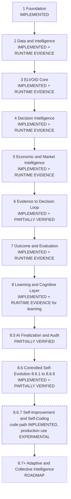
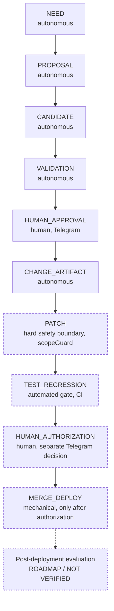

# CHANGES — ELSTAND Intelligence / ELVOID

**Long-form roadmap and engineering-evolution documentation.**

| | |
|---|---|
| Baseline | `main` @ `b4ae428` — "Add Evolution Command Center" (2026-10-03) |
| Role of this file | The long, technical version of the ELSTAND Intelligence roadmap. The roadmap presentation is the short version. |
| Companion documents | [`README.md`](./README.md) (overview, MVP slice) · [`docs/ELVOID_COGNITIVE_LAYER.md`](./docs/ELVOID_COGNITIVE_LAYER.md) (technical deep dive) · [`docs/changelog/ENGINEERING_DELTA_LOG.md`](./docs/changelog/ENGINEERING_DELTA_LOG.md) (historical engineering record) · the `/documentation` web page |
| Previous content of this file | The ~8 KB `/ai-performance` UI/UX note is preserved verbatim in [Appendix B](#appendix-b--uiux-delta). The older per-phase changelog is restored in the Delta Log ([Appendix A](#appendix-a--historical-engineering-record)). |

**Accuracy rule.** Accuracy over marketing; evidence over claim; implementation
over assumption. A feature is never promoted to a stronger status because it
looks present in source or because it was designed. Where evidence is missing
this document says so.

## Contents

- [Status legend](#status-legend) · [Evidence of record](#evidence-of-record) · [Roadmap at a glance](#roadmap-at-a-glance)
- [§0 Crosswalk](#0-crosswalk--three-naming-systems)
- Phases: [1 Foundation](#1-phase-1--foundation) · [2 Data & Intelligence](#2-phase-2--data--intelligence) · [3 ELVOID Core](#3-phase-3--elvoid-core) · [4 Decision Intelligence](#4-phase-4--decision-intelligence) · [5 Economic & Market Intelligence](#5-phase-5--economic--market-intelligence) · [6 Evidence → Decision](#6-phase-6--evidence--decision-loop) · [7 Outcome Evaluation](#7-phase-7--outcome-evaluation) · [8 Learning & Cognitive Layer](#8-phase-8--learning--cognitive-layer) · [8.5 AI Finalization & Audit](#85-phase-85--ai-finalization--audit) · [8.6 Controlled Self-Evolution](#86-phase-86--controlled-self-evolution) · [8.6.7 Self-Improvement / Self-Coding](#867-phase-867--controlled-self-improvement--self-coding--self-evolution) · [8.7+ Adaptive / Collective](#87-phase-87--adaptive--collective-intelligence)
- [Cross-cutting: verification, limitations, status ledger](#cross-cutting-verification-limitations-status-ledger)
- [Appendix A — Historical engineering record](#appendix-a--historical-engineering-record) · [Appendix B — UI/UX Delta](#appendix-b--uiux-delta)

---

## Status legend

| Status | Meaning in this repository |
|---|---|
| **IMPLEMENTED** | Code exists at the baseline and is callable or reachable from a runtime path. It says nothing about correctness. |
| **VERIFIED** | The claim is reproducible from artifacts stored in this repository (a fixture or CI result that passes, or stored runtime evidence). *At the runtime level no capability is VERIFIED from repository evidence alone, because runtime evidence is not stored here.* Fixture results are reported as counts instead. |
| **PARTIALLY VERIFIED** | Some behaviours are covered by reproducible evidence (typically offline fixtures); others are not, or the mapping itself is inferred. |
| **IMPLEMENTED + E2E/RUNTIME EVIDENCE AVAILABLE** | Implemented in source, and the maintainer reports runtime evidence observed in the AI Performance dashboard. That evidence is **not stored in this repository**, so the label is deliberately weaker than VERIFIED. |
| **EXPERIMENTAL** | Implemented (fully or in part), but operation end to end in one continuous runtime has not been demonstrated, or the values involved are explicitly provisional. |
| **ROADMAP** | Planned or conceptual. No implementing code adequate to support a stronger label. |
| **BLOCKED** | A check could not be run in the audit environment because a dependency was unavailable. This is **not** a pass and not a failure. |
| **NOT VERIFIED** | No evidence either way. |

Offline fixture results are evidence of *implementation-level behaviour*. They
are **not** live end-to-end evidence, and live end-to-end evidence is not
automatically VERIFIED unless reproducible production evidence is available.

## Evidence of record

| Tier | What it is | Reproducible from this repository? |
|---|---|---|
| E1 · Source | What the code does at `b4ae428`; file paths are cited throughout | Yes |
| E2 · Offline fixtures | `scripts/phase7`, `phase8`, `phase9` (self-checking TypeScript scripts) run read-only with Node 22, no `node_modules`, no network | Yes |
| E3 · Runtime evidence observed in the AI Performance dashboard | Reported by the maintainer. No capture, log or export is stored in the repository | **No** |
| E4 · Reproducible production evidence | Logs, deployment IDs, commit hashes of pipeline-made changes | **None stored** |

**E2 result (audit run).** 66 fixture files · 61 clean · **0 `FAIL`** · **1,488 `PASS` lines** ·
**5 BLOCKED** because a package is unavailable offline: four need
`@supabase/supabase-js` (`altcoin-screener`, `autonomous-paper-execution`,
`autonomous-runtime`, `macro-ingestion-lock`) and one needs `js-yaml`
(`controlled-autonomy-and-economic`). BLOCKED files are **not** counted as passes.
Per phase folder: `phase7` 9 files / 89 PASS · `phase8` 51 files (48 clean) / 1,301 PASS ·
`phase9` 6 files (4 clean) / 98 PASS.

**E3 — Runtime evidence observed in the AI Performance dashboard** (reported; not
stored here; no number below is derived from the repository):

- External Intelligence: 15/15 pairs, production runtime.
- Full autonomous pipeline: 15 pairs, stages `MARKET_DATA → ORACLE → CONFLICT → INTELLIGENCE → EXTERNAL_INTELLIGENCE → QUALIFICATION → PRE_ENTRY → DECISION → LEARNING → EXECUTION → CYCLE` as reported (the emission order in source differs slightly; see [cognitive-layer §11](./docs/ELVOID_COGNITIVE_LAYER.md#11-decision-lifecycle)).
- Approval boundary: Telegram approve / reject, duplicate-callback handling and idempotency.
- Runtime Intelligence Graph: relations between market data, macro intelligence, structure / liquidity, Oracle, risk, decision, execution, decision memory and learning feedback (the nine nodes of `lib/ai/cognitiveMap/registry.ts`).

Reproducible counterparts in E2: Decision Qualification 40 PASS, Pre-entry
Validation 25 PASS, Autonomous Decision 25 PASS (these match the 40/40, 25/25 and
25/25 figures above). **No evidence of any kind covers one complete evolution
cycle** (see [8.6.7](#867-phase-867--controlled-self-improvement--self-coding--self-evolution)).

CI: there is no `npm test` script. The only workflow that runs `tsc --noEmit` and
`next build` triggers on pushes to `elvoid/phase9/**` branches. No workflow runs
the fixture suites. `next build` was not run in the audit environment.

## Roadmap at a glance



Solid boxes are implemented in source; the dashed box has an implemented code path
whose production use is experimental; the dotted box is roadmap only.

---

## §0 Crosswalk — three naming systems

Three naming systems grew independently and collide. This section is the key to
reading every other document and every code comment.

1. **PPT** — the roadmap presentation: Phase 1 … 8, 8.5, 8.6 (8.6.1–8.6.7), 8.7+.
2. **Legacy editorial** — the per-phase headings of the old `CHANGES.md` (as of
   `54b6d1f`, restored in the Delta Log): *Phase 1 Foundation, 2 Market
   Intelligence, 3 Trading / Decision Infrastructure, 4 ELVOID Foundation, 5 ELVOID
   PRO / Oracle Evolution, 6 Cognitive Intelligence, 7 External Intelligence, 8
   Outcome & Learning, 8.x Controlled Self-Evolution, 9 Product & Production
   Hardening*.
3. **Code labels** — the identifiers in file headers and commit titles: `V1`–`V6.0`,
   `Phase 3.x`, `7.0`–`7.9`, `8.0.x`–`8.6.x`, `P0`–`P4`, and `phase9` (folders,
   workflows, branch prefix).

### 0.1 PPT ↔ code

| PPT | Meaning | Code labels and anchors | Mapping status |
|---|---|---|---|
| 1 | Foundation | `V1`–`V6.0`; legacy editorial Phases 1–4; `app/`, `components/`, `lib/intelligence/*`, `lib/elvoid/*` | Direct |
| 2 | Data & Intelligence | `lib/binance*`, `lib/intelligence/*`, `lib/economicData/*`, `lib/ai/externalIntelligence/*` (8.4.x) | Direct |
| 3–4 | ELVOID Core · Decision Intelligence | `7.0`–`7.9` (`lib/ai/oracle/*`); the Oracle's own internal "Phase 1–5" labels sit inside this range (see 0.2) | Direct; the 3 / 4 split is functional, not a historical label |
| 5 | Economic & Market Intelligence | `7.2`–`7.4` (market context), `8.2.3`–`8.2.4` (macro, event impact), Alpha Vantage primary source | Direct |
| 6 | Evidence → Decision loop | `8.2.1` (decision trace), `8.3.2` (cognitive trace), `P2` (confluence attribution); the decision path `8.2.0`, `8.2.2`, `8.2.5`–`8.2.8` is documented here by function | Direct for the three named; **PARTIALLY VERIFIED mapping** for the decision path |
| 7 | Outcome → Evaluation | `8.1.0`–`8.1.1` | Direct |
| 8 | Learning & Cognitive Layer | `8.0.x`, `8.1.2`–`8.1.5`, `8.3.x`, `8.2.9` | Direct |
| 8.5 | AI Finalization & Audit | Historical `8.5` commits are UI, observability and evaluation-backlog deltas (see [8.5](#85-phase-85--ai-finalization--audit)) | **PARTIALLY VERIFIED mapping — historically ambiguous; not invented** |
| 8.6.1–8.6.6 | Novelty · Cognitive Gap · Evolution Need · Proposal · Candidate + Replay · Validation + Regression Guard | The same labels in code, one-to-one (`lib/ai/noveltyDetection`, `cognitiveGap`, `reasoningGap` + `evolutionNeed`, `evolutionProposal`, `evolutionCandidate`, `evolutionValidation`) | Direct |
| 8.6.7 | Self-Improvement / Self-Coding / Self-Evolution | Human Approval Gate (`8.6.7` in code) + `P4` Change Artifact + the pipeline previously named "Phase 9" (`lib/ai/evolutionCoding`, `evolutionGit`, `evolutionDeploy`, `evolutionPipeline`) | Direct, with the historical label explained in 0.2 |
| 8.7+ | Adaptive / Collective Intelligence | None | **ROADMAP** — no implementing code |

### 0.2 Colliding terms

| Term | Meanings found in the repository |
|---|---|
| **"Phase 9"** | (a) legacy editorial heading "Phase 9 — Product & Production Hardening"; (b) the self-coding / controlled-autonomy pipeline (workflows `phase9-*`, branch prefix `elvoid/phase9/*`, comments "Phase 9"); (c) the folder `scripts/phase9/`, which also holds economic-data fixtures (`alpha-vantage-primary`, `macro-ingestion-lock`). **This documentation uses 8.6.7 for (b) and does not define a Phase 9.** Identifiers in code are unchanged. |
| **"P4"** | The Controlled Change Artifact (`c85f456`) and, separately, the commit title "Fix P4 Economic Data" (`efde18c`, economic ingestion only). Unrelated. |
| **"8.5"** | Code history: AI Performance UI deltas, Runtime Terminal, evaluation backlog, PEPE external-intelligence delta, Premium ELVOID connector. PPT: AI finalization and audit. |
| **"Phase 1–5" inside `lib/ai/oracle/*`** | The Oracle's own build phases (`dataAdapters` = 1, `confluence` = 2, `grading` = 3, `insight` = 4, `execute` = 5). They are not PPT phases. |
| **"Phase 5 / 6 / 7"** | Legacy editorial (Oracle, Cognitive, External) versus PPT (Economic & Market, Evidence → Decision, Outcome). Always qualify which system is meant. |
| **"Decision arbitration"** | `lib/ai/oracle/arbitration.ts` (7.7) *annotates* alignment and never overrides the grade. The `EXECUTE / WAIT / REJECT` value is produced by `lib/ai/autonomousDecision/decide.ts` (8.2.6). |
| **"community" vs "collective" intelligence** | Community intelligence (8.4.4) is a contract plus an honest "unavailable" analysis — no community source is integrated. Collective intelligence (8.7+) is ROADMAP. They are different things. |

### 0.3 The evolution flow in four vocabularies

| PPT flow (8.6) | Code module (8.6.x) | `controlPolicy.yaml` stage | Command Center stage (`deriveStage.ts`) |
|---|---|---|---|
| MONITOR | 8.6.1 `noveltyDetection`, `selfPerformance` | — | OBSERVE |
| DETECT | 8.6.2 `cognitiveGap`; 8.6.3 `reasoningGap`, `evolutionNeed` | NEED | GAP · EVIDENCE |
| PROPOSE | 8.6.4 `evolutionProposal`, `selfEvaluation` | PROPOSAL | PROPOSAL · PERSIST |
| TEST / REPLAY | 8.6.5 `evolutionCandidate` (+ replay) | CANDIDATE | CANDIDATE |
| PROTECT | 8.6.6 `evolutionValidation` (gates, regression guard) | VALIDATION | VALIDATION · REGRESSION · READY |
| APPROVE | 8.6.7 `evolutionApproval` (Telegram) | HUMAN_APPROVAL | HUMAN_APPROVAL |
| EVOLVE | 8.6.7 `evolutionArtifact` → `evolutionCoding` → CI → `evolutionPipeline/authorization` | CHANGE_ARTIFACT · PATCH · TEST_REGRESSION · HUMAN_AUTHORIZATION · MERGE_DEPLOY | CHANGE_ARTIFACT (ladder ends here) |

The row alignment is approximate; each stage's exact precondition is defined in
`lib/ai/evolutionCommandCenter/deriveStage.ts` and `controlPolicy.yaml`.

---

## 1. Phase 1 — Foundation

**Tujuan / Purpose.** Build the base of the ELSTAND ecosystem so that data can later
become intelligence and decisions: a product shell, identity and metering, AI
plumbing, a paper-trading base, and the rule that missing data is never disguised.

**Problem.** Market dashboards routinely blend real, proxied and missing data
without saying so, and AI features fail unpredictably. A decision engine built on
that would inherit the ambiguity.

**Architecture.** Next.js 14 (App Router) and React 18; Supabase for authentication
and data, plus a separate Supabase client for ELVOID's Learning DB
(`lib/ai/learning/db.ts`); server-side API keys; wagmi / viem for wallet connection.
Design rule: an unavailable source stays unavailable — it is never shown as neutral
or zero.

**Components.**
- `V1` (2026-07-25/26) first dashboard; `V2` Global Intelligence Map; `V4.1` three-tier interactive map; `V5.0` ELSTAND PREMIUM (a second, non-trading intelligence module).
- `V2.9` AI Router (Groq primary, OpenRouter fallback); `V3.0` AI Energy (reserve-then-refund metering).
- ELVOID Foundation: `lib/elvoid/engine.ts` (rule-based signal engine and risk-plan methodology) and `lib/elvoid/paperTrader.ts` (the `new → open/pending → tp1_hit → closed` paper-trading lifecycle).
- Ecosystem modules (Earn / DEX, Bug Hunter, Suggestions) — see the README; they are not part of the decision pipeline.

**Implementation.** The per-delta history of these items is the legacy Phases 1–4 in
the Delta Log, Part 1.

**Relasi dengan phase sebelumnya / Relation to the previous phase.** First phase.

**Verification.** `scripts/` contains only `phase7`, `phase8` and `phase9`; no fixture
targets Foundation-era modules. The status rests on source (E1) only.

**Limitations.** Some intelligence nodes have no real source and are always
"not connected" — there is no social-media integration anywhere in the repository
(stated in the `lib/intelligence/marketMap.ts` header and quoted in
`lib/ai/externalIntelligence/community/contracts.ts`). The app has a paper-trading path and a separate manual live-trading path (Binance Spot /
Futures, Testnet or Live; `POST /api/binance/order`, see the README); the autonomous ELVOID
runtime executes on **paper only**. External providers can be unavailable; the app then
reports unavailability.

**Status.** **IMPLEMENTED.** Not VERIFIED (no repository fixture).

---

## 2. Phase 2 — Data & Intelligence

**Tujuan / Purpose.** Integrate the four main data families — **market, macro,
on-chain, news / external** — and turn them into **evidence** and then
**intelligence**.

**Problem.** Without a registry and a hierarchy, sources mix implicitly: a missing
source reads as neutral, a proxy reads as a measurement, and a supporting source can
override a primary one.

**Architecture.**

```text
External sources → Data Layer (fetchers, caches) → Evidence (normalized, provenance-tagged) → Intelligence
```

- Every external source is listed in `lib/ai/externalIntelligence/registry.ts` (8.4.1). Its header states that each non-community entry maps to a fetch function that exists in the repository and that module path, env vars and cache TTL were read from the code.
- `reliability` in the registry describes provenance (who publishes the number, how directly). It is not a correctness score.
- The Research Trigger (8.4.2) decides whether external evidence is justified; it never fetches.
- Economic data hierarchy (owner decision, 2026-09-29): **Alpha Vantage is the primary source; FRED, ForexFactory and others are supporting.** Supporting data may enrich or confirm, never replace or outrank primary data.

**Components.**

| Family | Anchors |
|---|---|
| Market | `lib/binance.ts`, `lib/binance/*`, `lib/bybit.ts`, `lib/okx.ts`, `lib/coingecko.ts`, `lib/geckoterminal.ts`, `lib/alternativeme.ts`, `lib/derivatives.ts` |
| Macro / economic | `lib/economicData/*` (Alpha Vantage primary, FRED supporting), `lib/macro.ts`, `lib/economiccalendar.ts` |
| On-chain | `lib/alchemy.ts`, `lib/stablecoins.ts` |
| News / external | `lib/newsapi.ts`, `lib/intelligence/sources/*`, `lib/ai/externalIntelligence/*` |

External Intelligence (8.4.x): 8.4.1 Source Registry · 8.4.2 Research Trigger
(`researchTrigger/evaluate.ts`) · 8.4.3 Evidence Normalization (`evidence/normalize.ts`) ·
8.4.4 Community Intelligence (`community/analyze.ts`) · 8.4.5 Altcoin Screener evidence
(`screener/analyze.ts`). The one live socket into the decision pipeline is
`lib/ai/wiring/externalIntelligenceGate.ts` (8.3 × 8.4 wiring).

**Implementation.**
- Economic data is stored as two tables on purpose: `economic_releases` (a scheduled event) and `economic_observations` (a raw time-series value). Ingestion runs from `/api/economic-data/ingest` (Vercel cron `0 23 * * *`) under a lock (`macro_ingestion_lock`).
- `lib/economicData/ingest.ts` writes every Alpha Vantage observation unconditionally; `ingestHealth.ts` treats `PRIMARY_*` problems as failures and `supporting_*` as informational.
- The external gate is called by the orchestrator before pre-entry validation. Commit `0422237` (2026-10-02) separated "no fetch was possible" from "evidence insufficient".

**Relasi dengan phase sebelumnya / Relation to the previous phase.** Uses Phase 1's
plumbing (Supabase, caches, API keys) and its non-fabrication rule.

**Verification.**
- E2: `evidence-normalization` 42 PASS · `research-trigger` 31 · `community-intelligence` 28 · `external-intelligence-gate` 34 · `alpha-vantage-primary` 46 · `macro-intelligence` 43. **BLOCKED:** `macro-ingestion-lock` and `altcoin-screener` (both need `@supabase/supabase-js`).
- E3: External Intelligence on 15/15 pairs in the production runtime (reported; not stored here).

**Limitations.** Community Intelligence has **no integrated source** — its analysis
returns an honest "unavailable" result. The single fetch path covers derivatives
capabilities only. Provider outages produce `UNAVAILABLE`, never a substitute. Several
code comments predate the 2026-09-30 hierarchy change (`providers/fredProvider.ts`,
`economicIntelligence/oracleMacro.ts`); the later decision governs.

**Status.** **IMPLEMENTED + E2E/RUNTIME EVIDENCE AVAILABLE** for the core data → evidence
path. **Community Intelligence (8.4.4): EXPERIMENTAL** (contract and honest analysis; no
source). Ingestion lock: implemented, fixture **BLOCKED**.

---

## 3. Phase 3 — ELVOID Core

**Tujuan / Purpose.** Build ELVOID as a **Decision Intelligence Engine**, not an AI
signal generator. The spine is:

```text
Data → Evidence → Intelligence → Reasoning → Decision
```

ELVOID must understand evidence, context, conflict, scenario and risk *before* it
produces a structured decision.

**Problem.** A signal is a direction and a number. It cannot say what it rests on,
what contradicts it, how it could fail, or how it should later be judged.

**Architecture.** One canonical authority: `gradeConfluence()` in
`lib/ai/oracle/grading.ts` is the **sole** source of `side`, `grade`, `confidence` and
`riskStatus`. Every later layer is read-only or annotating and is pure code.
The language-model layer only narrates; it is never asked for numbers
(`lib/ai/oracle/reasoning.ts`).

**Components** (the Oracle's own build order in parentheses — see 0.2):
- `dataAdapters.ts` (1) assembles one `OracleContext`; it only reads from `lib/binance`, `lib/elvoid/*` and `lib/intelligence/*`.
- `confluence.ts` (2) scores independent LONG and SHORT evidence per source.
- `grading.ts` (3): Data Quality Gate → Contradiction Gate → Setup Validation → Risk Validation → Grade Engine → `OracleAssessment`, deterministic.
- `risk.ts` computes entry / SL / TP / R:R with the same method as `lib/elvoid/engine.ts`.
- `insight.ts` (4) turns the result into readable sections and named patterns; `execute.ts` (5) hands a signal to the existing paper-trading lifecycle; `presentation.ts` hides fields at the response layer only.
- `evidence.ts` (7.1): a thin, read-only normalized view over `ConfluenceResult`.

**Implementation.** Served through the ELVOID PRO Oracle route (`/api/elvoid-pro/oracle`)
and, from 8.2.x, assembled per cycle by `lib/ai/autonomousRuntime/orchestrator.ts`.
Phase 7.0 added a baseline script (`scripts/phase7/baseline.ts`) that runs the real
pipeline on a deterministic synthetic candle fixture.

**Relasi dengan phase sebelumnya / Relation to the previous phase.** Consumes Phase 2's
evidence and reuses Phase 1's engine methodology and paper-trading lifecycle.

**Verification.** E2: there is no dedicated fixture file for `confluence.ts` or
`grading.ts`; they are exercised indirectly by the fixtures that call them (the 7.5–7.9
fixtures and the `8.x` qualification, context and external-gate fixtures). The 7.0
baseline script exits cleanly and prints a snapshot (it has no `PASS` lines by design).
E3: the Oracle stage of the runtime pipeline on 15 pairs (reported).

**Limitations.** Grade and gate thresholds are deterministic constants; none has been
independently calibrated against live outcomes. Provisional values are marked as such in
source (see Phase 4 and the Delta Log).

**Status.** **IMPLEMENTED + E2E/RUNTIME EVIDENCE AVAILABLE.**

---

## 4. Phase 4 — Decision Intelligence

**Tujuan / Purpose.** Develop ELVOID's ability to reason about a decision:
**confluence, conflict detection, scenario analysis, risk intelligence, decision
arbitration, confidence and a risk plan.** The goal is not a "certain signal" but an
explainable decision that carries its risk context.

**Problem.** Agreement among indicators is not the same as confidence, and a risk plan
without invalidation context hides how the decision could be wrong.

**Architecture.** A chain of pure, read-only layers over the canonical assessment:

```text
confluence → mtf (7.2) → regime (7.3B) → liquidity/order flow (7.4) → scenario (7.5)
→ contradiction (7.6) → arbitration (7.7) → risk intelligence (7.8) → reasoning (7.9)
```

**Components.**
- `scenario.ts` (7.5): a PRIMARY scenario and, only when genuine opposing evidence exists, an ALTERNATIVE.
- `contradiction.ts` (7.6): reclassifies contradiction-shaped evidence already in the pipeline; exposes whether an unresolved genuine contradiction exists.
- `arbitration.ts` (7.7): annotates alignment and **never** recomputes or overrides `side`, `grade`, `confidence` or `riskStatus`.
- `riskIntelligence.ts` (7.8): descriptive reading of the existing risk plan; it does not compute a second plan or gate anything.
- `reasoning.ts` (7.9): narrative over the finished pipeline; never a decision engine.
- Downstream decision gates (8.2.x, documented in Phase 6): qualification, pre-entry validation and the `EXECUTE / WAIT / REJECT` decision in `autonomousDecision/decide.ts`.

**Implementation.** The decision rule in `decideAutonomous()` is a strict priority
order: (1) required context missing or qualification / pre-entry insufficient → `WAIT`;
(2) pre-entry blocked → `REJECT`; (3) qualification conflicted → `REJECT`; (4) pre-entry
caution → `WAIT`; (5) pre-entry valid **and** qualification qualified → `EXECUTE`; (6)
anything else → `WAIT`. There is no path that defaults to `EXECUTE`.

**Relasi dengan phase sebelumnya / Relation to the previous phase.** Annotates and
challenges the Phase 3 assessment without ever replacing its authority.

**Verification.** E2 (`scripts/phase7`): `scenario` 13 · `contradiction` 8 · `arbitration`
12 · `risk-intelligence` 11 · `reasoning` 14 PASS. Decision gates (`scripts/phase8`):
`decision-qualification` **40** · `pre-entry-validation` **25** · `autonomous-decision`
**25** PASS. E3: the decision stages across 15 pairs (reported).

**Limitations.** The negative-memory thresholds used by qualification
(`NEGATIVE_MEMORY_MIN_OCCURRENCE_COUNT` = 5, `NEGATIVE_MEMORY_FRESHNESS_WINDOW_DAYS` = 30)
are labelled **PROVISIONAL CALIBRATION BASELINE** in
`lib/ai/decisionQualification/contracts.ts` — mirrors of other constants, not
independently calibrated. There is no statistical confidence-calibration model;
`confidenceAlignment` is a categorical flag (`ALIGNED / MISALIGNED / UNKNOWN`).

**Status.** **IMPLEMENTED + E2E/RUNTIME EVIDENCE AVAILABLE.**

---

## 5. Phase 5 — Economic & Market Intelligence

**Tujuan / Purpose.** Connect **economic intelligence** and **market intelligence** so
that every piece of evidence — market structure, macro context, news and external
signals, multiple timeframes, liquidity, order flow — takes part in the decision process.

**Problem.** A technically clean setup can be wrong for the macro or event environment
it sits in, and a macro reading built from a supporting source can silently mislead.

**Architecture.** Two context families feed the same pre-entry gate: market context
(`mtf`, `regime`, `liquidityOrderFlow`) and economic context (`macroIntelligence`,
`eventImpact`, `economicIntelligence`). Economic context is built from the **primary**
source only: `lib/ai/macroIntelligence/composeMacroContext.ts` uses Alpha Vantage
observations (`buildPrimaryRelease`); a missing, stale or non-consecutive primary
observation makes that indicator `UNAVAILABLE` (fail-closed) and is never substituted
from a supporting source.

**Components.**
- Market: `mtf.ts` (7.2, a descriptive relationship label — not a second direction), `regime.ts` (7.3B), `liquidityOrderFlow.ts` (7.4: liquidity zones from candles, footprint, TPO and swings).
- Economic: `lib/ai/macroIntelligence/*` (8.2.3), `lib/ai/eventImpact/*` (8.2.4), `lib/ai/economicIntelligence/*` (`oracleMacro.ts`, `oracleMacroPure.ts`, `failClosed.ts`), `lib/economicData/*`.
- News / external: via Phase 2's registry and the external gate (see Phase 2).

**Implementation.** Alpha Vantage as primary source landed 2026-09-30 (`af79566`,
`96563eb`). The stated reason in source: `economic_observations` held 2,713 Alpha Vantage
rows that nothing read, so every Oracle snapshot carried `macro_state UNKNOWN / UNKNOWN`.
A throw while analysing event impact becomes an `UNAVAILABLE` context, so pre-entry yields
`CAUTION`, never `VALID` / `EXECUTE` (`economicIntelligence/failClosed.ts`).

**Relasi dengan phase sebelumnya / Relation to the previous phase.** Extends the Phase 4
decision chain with context that can *block* or *caution* a qualified setup at pre-entry.

**Verification.** E2: `mtf` 7 · `regime` 8 · `liquidity-orderflow` 16 · `macro-intelligence`
43 · `event-impact` 51 · `alpha-vantage-primary` 46 PASS. **BLOCKED:**
`controlled-autonomy-and-economic` (needs `js-yaml`). E3: the macro-intelligence node of the
Runtime Intelligence Graph (reported). Live Alpha Vantage ingestion is not itemized by that
evidence and is **NOT VERIFIED** from the repository.

**Limitations.** Economic data refreshes on a daily cron; it is not a real-time feed. A
primary-source outage degrades the macro reading to `UNAVAILABLE` rather than falling back.

**Status.** **IMPLEMENTED + E2E/RUNTIME EVIDENCE AVAILABLE** (market and macro context in
the live pipeline). Alpha Vantage live ingestion: **NOT VERIFIED** from the repository.

---

## 6. Phase 6 — Evidence → Decision Loop

**Tujuan / Purpose.** Make every decision traceable:

```text
Evidence → Conflict / Risk → Reasoning → Decision        (the decision then produces an outcome)
```

**Problem.** A decision that cannot be traced to its evidence cannot be audited or
learned from. Before `P3` a cycle that ended `BLOCKED`, `CAUTION` or
`INSUFFICIENT_CONTEXT` could not be attributed to a gate afterwards; the source comment
cites 1,007 such historical cycles *(source comment, not independently verified)*.

**Architecture.** One cycle, run by `lib/ai/autonomousRuntime/orchestrator.ts`
(`runAutonomousCycle`), in this order of emission: `MARKET_DATA → ORACLE → INTELLIGENCE →
CONFLICT → QUALIFICATION → EXTERNAL_INTELLIGENCE → PRE_ENTRY → DECISION → EXECUTION →
LEARNING`, bracketed by `CYCLE`. Each stage calls a pure function, and a stage emits a
runtime event only when its operation actually ran (there are no synthetic or heartbeat
events — `runtimeEvents/emit.ts`).

**Components.**
- **Decision context** (8.2.0) `lib/ai/autonomous/context.ts` — one closed input for the decision engines.
- **Qualification** (8.2.2) `decisionQualification/qualify.ts` → `QUALIFIED / CAUTION / CONFLICTED / INSUFFICIENT_CONTEXT`. Ordered rules: ineligible source, missing assessment or a non-qualifying grade → `INSUFFICIENT_CONTEXT`; a negative-memory signal → `CONFLICTED`; invalid risk or a caution constraint → `CAUTION`; otherwise `QUALIFIED`. `P0` bounded negative memory: `INSUFFICIENT_EVIDENCE / STALE_MEMORY / FAMILIAR_NEGATIVE / MIXED_EVIDENCE / CURRENT_NEGATIVE_EVIDENCE`.
- **Pre-entry validation** (8.2.5) `preEntryValidation/validate.ts` → `VALID / CAUTION / BLOCKED / INSUFFICIENT_CONTEXT` (missing context → insufficient; qualification conflicted, or elevated macro / event risk → blocked; conflicting impact, invalid risk, incomplete macro or news data, caution, or conflicting / insufficient external evidence → caution).
- **Decision** (8.2.6) `autonomousDecision/decide.ts` → `EXECUTE / WAIT / REJECT` (priority order in Phase 4).
- **Execution** (8.2.7) `autonomousExecution/execute.ts` — one fixed gate (`decision === "EXECUTE"`) then the existing `executeOracleSignal()` → `paperTrader.executeSignal()`; outcomes `EXECUTED / SKIPPED_WAIT / SKIPPED_REJECT / SKIPPED_UNSUPPORTED_SOURCE / EXECUTION_FAILED`. Paper trading only.
- **Traceability:** `decisionTrace` (8.2.1); `cognitiveTrace` (8.3.2, append-only, verbatim copies of already-computed values); `cognitiveReplay` (8.3.7); `causalGraph` (8.3.8); `cognitiveMap` (8.3.1, nine nodes); `confluenceAttribution` (`P2`); `decisionPopulation` (`P1`); per-cycle attribution metadata (`P3`).

**Implementation.** `P3` (`333ffb6`) persists `qualification.signals`, negative-memory
state and count, and `preEntry.signals` in the runtime-event metadata, so a non-`EXECUTE`
cycle is attributable to a gate. `P1` can report `REJECT_DOMINANCE_GAP` on a separate
`populationGaps` field; per the template comment in `evolutionProposal/propose.ts`
nothing yet feeds that field into the evolution-need gate.

**Relasi dengan phase sebelumnya / Relation to the previous phase.** Consumes the Phase 4
assessment and the Phase 5 macro / event / external context; adds the decision, its trace
and its execution result.

**Verification.** E2: `decision-qualification` 40 · `pre-entry-validation` 25 ·
`autonomous-decision` 25 · `autonomous-context` 22 · `decision-trace` 20 ·
`cognitive-trace` 16 · `cognitive-replay` 61 · `causal-graph` 38 ·
`neural-edge-intelligence` 17 · `confluence-attribution` 22 · `decision-population` 44 PASS.
**BLOCKED:** `autonomous-paper-execution` and `autonomous-runtime` (need
`@supabase/supabase-js`). The `autonomous-runtime` header itself lists a true end-to-end
orchestrator test as a known limitation, because the orchestrator has no
dependency-injection seam. E3: the full autonomous pipeline on 15 pairs and the Runtime
Intelligence Graph (reported).

**Limitations.** The orchestrator's end-to-end behaviour has no runnable offline test; its
evidence is E3. The `LEARNING` runtime stage is a *classification* ("will this result enter
the learning lifecycle on close", 8.2.8) emitted after `EXECUTION`; the actual learning runs
on trade close (Phase 7–8). The watchlist default is 15 symbols
(`lib/elvoid/watchlist.ts`), but the live list is editable.

**Status.** Decision path (context, qualification, pre-entry, decision, execution):
**IMPLEMENTED + E2E/RUNTIME EVIDENCE AVAILABLE.** Traceability features (trace, replay,
causal graph, attribution, population): **IMPLEMENTED + PARTIALLY VERIFIED.**

---

## 7. Phase 7 — Outcome Evaluation

**Tujuan / Purpose.** The outcome does not end the story. The flow is

```text
Decision → Outcome → Evaluation
```

and the system judges whether a decision succeeded or failed, then feeds that into learning.

**Problem.** A paper trade's PnL does not say whether the *decision* was sound at the time
or whether the market confirmed it. Without a structured link between the decision-time
snapshot and the realized outcome, nothing can be learned reliably.

**Architecture.** Two axes (`lib/ai/decisionEvaluation/contracts.ts`): (1) was the decision
structurally sound at decision time; (2) what the market actually did, read verbatim from
the Learning DB outcome. Their combination gives an evaluation class (including
`NEUTRAL_OUTCOME`), plus categorical `confidenceAlignment` (`ALIGNED / MISALIGNED /
UNKNOWN`) and `contextAlignment` flags. `ai_journal` remains the canonical outcome
authority; the Learning DB write is best-effort and never blocks a trade close.

**Components.**
- 8.1.0 `lib/ai/decisionOutcome/*` — outcome capture into the Learning DB (`decision_experiences`).
- 8.1.1 `lib/ai/decisionEvaluation/*` — pure `evaluate` plus a repository.
- 8.1.1.1 `lib/ai/decisionLearning/lifecycle.ts` — the only module that knows both domains; it sequences "capture, then evaluate" with a real `await`, because two independent fire-and-forget calls could race and permanently lock a wrong early evaluation row.
- 8.5 `lib/ai/autonomousRuntime/evaluationBacklog.ts` — retries closed-but-unevaluated experiences in bounded batches under its own lock.

**Implementation.** On a paper-trade close, `lib/elvoid/paperTrader.ts` inserts the
`ai_journal` row first, then starts `completeDecisionLearningLifecycle()` (not awaited,
failures logged), and on success calls `triggerLearningRefreshBestEffort()` and
`triggerEvaluationBacklogBestEffort()`. The backlog trigger exists because, per its header,
106 of 146 closed `decision_experiences` (72.6 %) had never received an evaluation row
*(source comment — a production measurement quoted in code; not independently verified)*.

**Relasi dengan phase sebelumnya / Relation to the previous phase.** Consumes the Phase 6
decision records and the paper-execution result.

**Verification.** E2: `decision-outcome` 36 · `decision-evaluation` 36 ·
`decision-learning-lifecycle` 21 PASS. E3: outcome → evaluation → learning feedback visible in
the AI Performance dashboard (reported).

**Limitations.** Outcomes come from paper trades only, so evidence accrues at the pace of
closed trades. There is no statistical calibration model. The Learning DB write is
fire-and-forget by design; a failure is logged, not retried by the close path (the backlog
trigger is the retry).

**Status.** **IMPLEMENTED + E2E/RUNTIME EVIDENCE AVAILABLE.**

---

## 8. Phase 8 — Learning & Cognitive Layer

**Tujuan / Purpose.** Build a learning and cognitive layer that can find *where* ELVOID
needs to improve: novelty, cognitive gap, reasoning gap, evolution need, proposal,
candidate, replay, validation and regression guard. **Learning must not change
production directly**; it identifies areas for improvement.

**Problem.** A system that only records outcomes cannot say what to improve, and one that
"learns" by silently rewriting itself cannot be audited.

**Architecture.** Two layers.
1. **Learning loop (data → data).** Outcomes → evaluations → failure patterns → adaptive
   constraints → constraint validations → decision-memory retrieval. These are
   deterministic aggregations over rows. They change *data inputs* that qualification reads
   under fixed rules; they never edit code, thresholds or decision logic.
2. **Cognitive layer.** Observation, working memory, hypotheses, conflict resolution and
   context (8.0.x), plus introspection (cognitive map, trace, replay, causal graph, neural
   edge — 8.3.x). The detectors that locate improvement areas (novelty, cognitive gap,
   reasoning gap, evolution need) are 8.6.1–8.6.3 and are documented in [8.6](#86-phase-86--controlled-self-evolution).

**Components and anchors.**

| Label | What | Anchor | E2 PASS |
|---|---|---|---|
| 8.1.2 | Failure-pattern detection (`MIN_OCCURRENCE_COUNT` = 5) | `lib/ai/failurePatterns` | 16 |
| 8.1.3 | Decision-memory retrieval | `lib/ai/decisionMemory` | 24 |
| 8.1.4 | Adaptive constraints | `lib/ai/adaptiveConstraint` | 21 |
| 8.1.5 | Learning validation (30-day freshness window) | `lib/ai/learningValidation` | 27 |
| 8.2.8–8.2.9 | Learning-lifecycle classification and runtime wiring | `lib/ai/autonomousLearning`, `autonomousRuntime/learningRefresh.ts` | 17 |
| 8.0.1–8.0.5 | Cognitive observation, memory, hypothesis, conflict, context | `lib/ai/cognitive/*` | 10 · 39 · 24 · 18 · 22 |
| 8.3.x | Map, trace, replay, causal graph, neural edge | `cognitiveMap`, `cognitiveTrace`, `cognitiveReplay`, `causalGraph` | see Phase 6 |

**Implementation.** Decision memory is read live every cycle:
`queryDecisionMemory()` (orchestrator Step 3, a failed lookup returns `null`) feeds
qualification. `learningRefresh.ts` recomputes failure patterns → constraints → validations
in that fixed order, guarded by a lock, and is triggered after each trade close. It adds no
detection or validation logic of its own.

**Relasi dengan phase sebelumnya / Relation to the previous phase.** Consumes Phase 7's
evaluated outcomes and closes the loop back into Phase 6's qualification.

**Verification.** E2 as tabled (learning 8.1.x total 198 PASS; cognitive 8.0.x total 113).
E3: learning feedback and the Runtime Intelligence Graph in the dashboard (reported).
Cognitive Gap detection is assessed **PARTIALLY VERIFIED** (fixtures plus partial runtime).

**Limitations.** The influence of learning on decisions is narrow and bounded
(negative-memory and constraint states can move qualification to `CONFLICTED` or `CAUTION`).
The thresholds involved are provisional. The legacy changelog said the lifecycle
classification had no callers (as of 2026-09-26); that is superseded — the orchestrator
calls it every cycle (Step 8). The chain *outcome → learning → self-coding → production
improvement* is **not** demonstrated (see 8.6.7).

**Status.** Learning loop: **IMPLEMENTED + E2E/RUNTIME EVIDENCE AVAILABLE.** Cognitive layer:
**IMPLEMENTED + PARTIALLY VERIFIED** (the Cognitive Map is the Runtime Intelligence Graph seen
in the dashboard). Cognitive Gap detection: **PARTIALLY VERIFIED.**

---

## 8.5 Phase 8.5 — AI Finalization & Audit

**Tujuan / Purpose.** Finalize and audit the AI before controlled evolution: a consistent
intelligence pipeline, explainable reasoning, a clear decision lifecycle, available
evaluation, traceable learning, guardrails, and claims that match the implementation.

**Problem.** Controlled evolution must start from a system whose claims can be trusted.

**Architecture / mapping.** **PARTIALLY VERIFIED mapping.** The historical `8.5` commits
(2026-09-08 → 09-12) are: `P0 Fix`, `Delta 2` PEPE External Intelligence, `Delta 3`
Evaluation Backlog, `Delta 4` Runtime Terminal (+ hotfix), `Delta 5` AI Performance
Redesign, `Delta 6` Event Ordering Fix, Mobile UI Polish, Premium ELVOID Connector and
Correction Indicator Interpretation. They are observability, evaluation and UI deltas, not a
formal audit. The presentation's meaning is therefore mapped by criterion, not by label.

**Components — criterion by criterion.**

| PPT criterion | Repository evidence | Assessment |
|---|---|---|
| Pipeline consistent | One canonical authority (`grading.ts`); a fixed cycle ladder; pure stage functions | PARTIALLY VERIFIED (orchestrator-level test BLOCKED offline) |
| Reasoning explainable | `reasoning.ts` narrates only; `cognitiveTrace` copies verbatim; `P3` persists gate signals | IMPLEMENTED |
| Decision lifecycle clear | Closed status sets; strict `decideAutonomous()` priority; 12 runtime-event components | IMPLEMENTED + E2E/RUNTIME EVIDENCE AVAILABLE |
| Evaluation available | `evaluationBacklog.ts` (Phase 8.5) clears unevaluated closed decisions | IMPLEMENTED; effect NOT VERIFIED |
| Learning traceable | `learningRefresh.ts` fixed sequence; stored pattern / constraint / validation rows | PARTIALLY VERIFIED |
| Guardrails available | Fail-closed defaults; bounded negative memory; the 8.6.7 gates | IMPLEMENTED (thresholds provisional) |
| Claims match implementation | This documentation alignment against `b4ae428` corrected a series of stale or over-stated claims (Cross-cutting §C) | PARTIALLY VERIFIED — a documentation audit, not a test |

**Implementation.** See the table. The audit is documentation-only and changes no runtime
logic.

**Relasi dengan phase sebelumnya / Relation to the previous phase.** Audits Phases 2–8
before 8.6 begins.

**Verification.** The documentation audit was a read-only repository review plus the E2
fixture run. It is not a test of live behaviour.

**Limitations.** The mapping is inferred. No single artifact in the repository declares
"Phase 8.5 complete".

**Status.** **PARTIALLY VERIFIED.**

---

## 8.6 Phase 8.6 — Controlled Self-Evolution

**Tujuan / Purpose.** Give ELVOID a *cognitive evolution pipeline* in which nothing
reaches production on the system's own authority:

```text
MONITOR → DETECT → PROPOSE → TEST / REPLAY → PROTECT → APPROVE → EVOLVE
```

**Problem.** Once a weakness is detected there must be a disciplined path to change it;
unrestricted self-modification is unsafe, and the system must not define "better" by itself.

**Architecture.** Each step is a pure, deterministic function over already-computed rows;
the only persistence is append-only records. 8.6.1–8.6.6 produce *evidence and records*, never
code. The Learning DB tables used here include `evolution_proposals`, `evolution_candidates`
and `evolution_validation_records`.

**Components.**

| Label | Module | What it does (from source) | E2 PASS | Status |
|---|---|---|---|---|
| 8.6.1 | `noveltyDetection`, `selfPerformance` | Rule-based novelty classification — a fixture asserts the file has no embeddings, vectors, network, clock, randomness or LLM call. Self-performance aggregation and evaluation-coverage. | 15 · 19 | IMPLEMENTED + PARTIALLY VERIFIED |
| 8.6.2 | `cognitiveGap` | Detects `CognitiveGap`s in six categories (contradiction, context, reasoning consistency, confidence alignment, evidence, pattern). Each needs at least `MIN_OCCURRENCE_COUNT` repeats. `P1` adds a separate population gap (`REJECT_DOMINANCE_GAP`). | 19 | IMPLEMENTED + PARTIALLY VERIFIED |
| 8.6.3 | `reasoningGap` (Part A), `evolutionNeed` (Part B) | Part A filters gaps to the reasoning subset with fixed statements. Part B is a gate returning `NO_EVOLUTION_NEEDED`, `INSUFFICIENT_EVIDENCE`, `MONITOR` or `EVOLUTION_WARRANTED`. A proposal is warranted only for a HIGH-severity gap or 2+ independently active categories, with no existing VALID constraint already covering the pair. | 17 (no separate reasoning-gap file; covered by the need and proposal fixtures) | IMPLEMENTED + PARTIALLY VERIFIED |
| 8.6.4 | `evolutionProposal`, `selfEvaluation` | Fixed per-category template text filled only with numbers already in the evidence — no language model. `selfEvaluation` composes an OBSERVED / INFERRED / UNKNOWN summary. | 15 (none dedicated to `selfEvaluation`) | IMPLEMENTED + PARTIALLY VERIFIED |
| 8.6.5 | `evolutionCandidate` | A candidate plus a **split-history replication check**: the same pure gap functions run on the older and the newer half of the same historical population. **It is not a counterfactual re-execution of changed logic**, and a candidate never contains code, a diff or a patch. | 17 | IMPLEMENTED + PARTIALLY VERIFIED |
| 8.6.6 | `evolutionValidation` | Seven fixed engineering gates and a regression check, written as append-only validation records keyed by `recordHash`. | 15 · 33 · 38 · 38 (validate · gates · records · hardening) | IMPLEMENTED + PARTIALLY VERIFIED |

The seven gates (all must pass for `VALID`): at least 20 eligible decisions in **each**
window; the target rate decreased; by at least 5 percentage points; and by at least 20 %
of the older window's rate; no newly active gap category; the regression axis was actually
evaluated; and it found none. Comparisons use exact integer cross-multiplication. Meeting
every gate means only that the observational evidence cleared the thresholds. It is **not**
statistical significance, not causal proof, and not evidence that anything is safe for
production.

**Implementation.** Validation records are append-only and keyed by a content hash (`recordHash`). Proposal text for the
six original gap categories is fixed per category (the comment in `propose.ts` notes that
`REJECT_DOMINANCE_GAP` is written but not yet reachable through the need gate).

**Relasi dengan phase sebelumnya / Relation to the previous phase.** Turns Phase 8's
detection capability into a pipeline of records; reads the Phase 7–8 evaluations and learning
rows as its only inputs.

**Verification.** E2: the 8.6.1–8.6.6 family totals **226 PASS** across 10 clean files (plus
`cognitive-replay` 61, a separate read-only reconstruction). No end-to-end single-cycle
evidence beyond that.

**Limitations.** Replay is observational, not counterfactual. The gate thresholds are fixed
engineering values, not statistically derived. Proposals are text, not changes. Evidence for
a gap requires accumulated closed decisions, so the pipeline is idle until enough exist.

**Status.** **IMPLEMENTED + PARTIALLY VERIFIED** at the implementation level (fixtures).
End to end in one continuous runtime: **EXPERIMENTAL** (no full E2E). Cognitive Gap
detection: **PARTIALLY VERIFIED** (fixtures plus partial runtime).

---

## 8.6.7 Phase 8.6.7 — Controlled Self-Improvement / Self-Coding / Self-Evolution

> **Terminology.** This is the phase that the repository's code, workflows and some
> comments call **"Phase 9"** (`scripts/phase9/`, `.github/workflows/phase9-*.yml`, branch
> prefix `elvoid/phase9/*`). Those identifiers are historical labels and are unchanged.
> **There is no Phase 9 on the roadmap.** See [§0.2](#02-colliding-terms).

**Tujuan / Purpose.** The most advanced part of the Cognitive Evolution track:

> ELVOID may look for ways to become better, but ELVOID may not decide for itself what
> "better" means.

Self-improvement here is **not** unrestricted recursive self-modification. *Self-coding*
means ELVOID can generate or propose a change based on a reasoning gap, evidence,
evaluation and validated learning. A production change must pass:

```text
Proposal → Candidate → Replay → Validation → Regression Guard → Human Approval → Deployment → Verification
```

**Problem.** A detected, validated weakness still has to become a code change. Doing that by
hand does not scale; doing it with no gate is unsafe.

**Architecture.** `controlPolicy.yaml` declares ten stages, each with an owner:



Stages whose control is `human` cannot be satisfied by the system on its own behalf. A
language model may write the patch (PATCH), but nothing it writes reaches production without
CI success **and** a second, separate human decision.

**Components.**

| Component | Anchor | Function | E2 PASS | Status |
|---|---|---|---|---|
| Self-evaluation | `lib/ai/selfEvaluation`, `selfPerformance` | OBSERVED / INFERRED / UNKNOWN summary; performance aggregation | 19 | IMPLEMENTED |
| Proposal · candidate · replay · validation · regression guard | `lib/ai/evolution{Proposal,Candidate,Validation}` | See 8.6 | see 8.6 | IMPLEMENTED + PARTIALLY VERIFIED |
| Human approval (Telegram) | `lib/ai/evolutionApproval/*`, `app/api/ai-performance/approvals/telegram` | One approver identified by **numeric** Telegram id; webhook secret compared in constant time; config fails closed if any of the three secrets is missing; state machine makes a repeated decision idempotent | 82 + 43 | IMPLEMENTED + E2E/RUNTIME EVIDENCE AVAILABLE |
| Change artifact | `lib/ai/evolutionArtifact/*` | Built only from a `VALID` validation record whose approval hash matches; re-checks gates and regression; `affectedFiles` is a fixed regex over the proposal text | 21 | IMPLEMENTED |
| Patch generation | `lib/ai/evolutionCoding/generate.ts` | One AI Core call returns **full-file replacements** for the named files; `NOT_CONFIGURED`, `NO_AFFECTED_FILES_SCOPE`, `INVALID_RESPONSE`, `SCOPE_VIOLATION` or `GENERATED` | 11 | IMPLEMENTED · EXPERIMENTAL |
| `scopeGuard` denylist | `lib/ai/evolutionCoding/scopeGuard.ts` | Pure check: each path must equal one of `affectedFiles`; no traversal; path and content denylists that win over the allowlist | (in the 11) | IMPLEMENTED |
| Git branch / push | `lib/ai/evolutionGit/pushChange.ts` | Branch `elvoid/phase9/<recordHash[:16]>`; stops at a pushed branch | 12 (with the pipeline) | IMPLEMENTED · EXPERIMENTAL |
| Test / regression | `.github/workflows/phase9-patch-check.yml`, `evolutionPipeline/checks.ts` | `tsc --noEmit` and `next build`; polls the CI result of the exact pushed commit | — | IMPLEMENTED · live runs NOT VERIFIED |
| Human authorization | `lib/ai/evolutionPipeline/authorization.ts` | A second, distinct Telegram decision after CI success; the **only** caller of the merge; atomic claim so one redelivered press wins | **BLOCKED** (needs `js-yaml`) | IMPLEMENTED · EXPERIMENTAL |
| Database trigger | `supabase/learning/migrations/2026-09f-…guard.sql` | A row cannot reach `PUSH_SUCCESS_DEPLOY_PENDING` or `DEPLOY_*` unless `authorized_by` and `authorized_at` are set; they cannot later change | — | IMPLEMENTED · applied state NOT VERIFIED |
| Merge / deploy | Authorization → merge → Vercel Git integration; `evolutionDeploy/vercelClient.ts`, `…/deployment-webhook` | Mechanical after authorization; a webhook turns a Vercel terminal deployment state into a final run result | partly BLOCKED | IMPLEMENTED · EXPERIMENTAL |
| Command Center | `lib/ai/evolutionCommandCenter/*`, `components/ai-performance/cognitive/EvolutionCommandCenter.tsx` | Read-only 11-stage ladder ending at `CHANGE_ARTIFACT` | none found | IMPLEMENTED |

**Implementation — how precisely to read the autonomy statements.**

- *The LLM may generate a patch.* That is **not** unrestricted autonomous production
  mutation. `scopeGuard` bounds what may be written; CI must pass for the exact commit; a
  human must authorize the merge.
- `controlPolicy.yaml` labels `MERGE_DEPLOY` as `control: autonomous`, while
  `autonomy.neverAutonomous` lists `production_merge` and `production_deploy` (and
  `scope_expansion`, `denylist_override`, `approval`, `authorization`, `secret_access`,
  `risk_gate`, `decision_gate`). The file is data; its header states that the human
  requirement is enforced in code and by the database trigger, not by the YAML. Read with the
  preceding `HUMAN_AUTHORIZATION` stage, the accurate wording is:
  **"Mechanically executable after explicit human authorization"** — and **not**
  "fully autonomous production deployment". The two labels are not reconciled inside the
  YAML; that historical inconsistency is documented here and left unedited.
- *Scope reality (read from `propose.ts`, `evolutionArtifact/create.ts`, `generate.ts`,
  `scopeGuard.ts`; no fixture asserts it).* The current proposal templates name only four
  source files. Two gap categories yield a patchable, non-denylisted scope:
  `CONTRADICTION_GAP` → `lib/ai/cognitive/conflict.ts` and `REASONING_CONSISTENCY_GAP` →
  `lib/ai/cognitive/hypothesis.ts`. Four categories name no path, so generation ends in
  `NO_AFFECTED_FILES_SCOPE`. `REJECT_DOMINANCE_GAP` names a denylisted decision-gate file and
  is not yet fed into the need gate. The denylist does not enumerate every decision-relevant
  module (for example `lib/ai/oracle/*` or `lib/elvoid/*`); in practice scope is limited by
  these templates.
- The P4 artifact's own status text still says "Awaiting a human-authored patch". The current
  pipeline can instead use a model-generated patch, bounded by `scopeGuard`, CI and
  authorization. The text was not changed (runtime out of scope).

**Relasi dengan phase sebelumnya / Relation to the previous phase.** Consumes the 8.6.6
validation record as its only entry point and the 8.6.7 approval as its first gate.

**Historical gate limitation.** Before commit `7e12508` (2026-09-28) a pipeline run could
merge and trigger a deploy **immediately after code generation**. The Delta Log (Part 1)
records that design as "full auto to production, single Telegram APPROVE as final
authorization", with no pre-merge `tsc` / `next build`, and notes it had never run against
real GitHub, Vercel or AI Core credentials. A code comment calls the resulting mismatch
between approval wording and behaviour a "confirmed-live finding". `7e12508` introduced the
current model: stop at a pushed branch; require a CI result for that commit (a missing or
ambiguous result never counts as success); require a second human authorization; extend the
`scopeGuard` denylist to the gating machinery; and add the database trigger. The current
authorization model **did not exist** for the first version of the pipeline, and this
document describes the current model, not the historical one.

**Verification.**
- E2 offline: approval 125 · artifact 21 · coding 11 · git-and-pipeline 12 PASS (169 total).
  **BLOCKED:** `controlled-autonomy-and-economic` — the fixture that covers the CI-gate and
  authorization path and the policy loader needs `js-yaml`, so that path has **no passing
  offline evidence in the audit run.**
- E3: the approval boundary — Telegram approve / reject, duplicate-callback handling and
  idempotency — observed working (reported; not stored here).
- Not exercised in any evidence available: a complete cycle *candidate → approval → self-code
  → regression → authorization → merge → deploy → production verification → outcome →
  learning → evolution feedback*. `main`'s history in this snapshot has no commit carrying a
  pipeline branch name (`elvoid/phase9/*`).
- The CI gate is a type-check and a production build. It does not run the repository's
  fixture suites, so it cannot show that decision behaviour is unchanged.

**Limitations.**
1. No full evolution E2E in one continuous runtime has been demonstrated.
2. Deployment verification is build-level only (a Vercel deployment reaches `READY`,
   `ERROR` or `CANCELED`). **Post-deployment evaluation — did the change actually improve
   decisions — and the resulting feedback loop have no implementation: ROADMAP / NOT
   VERIFIED.**
3. Offline evidence for the authorization path is BLOCKED; the DB trigger's applied state is
   unknown; a schema owner could drop it, and GitHub's merge API remains reachable outside
   this application (the migration's own caveat).
4. Scope is narrow and bounded by templates, not by a complete denylist (see above).
5. Validation gates are observational thresholds, not proof of improvement.
6. The 8.6.7 code is documented as written; no log, deployment ID or commit produced by the
   pipeline is part of this repository.

**Status.** Code path **IMPLEMENTED.** Self-coding in production **EXPERIMENTAL.** Human
Approval boundary **IMPLEMENTED + E2E/RUNTIME EVIDENCE AVAILABLE.** Merge / deploy
(evolution) **EXPERIMENTAL.** Production verification of an evolution **NOT VERIFIED.**
Post-deployment evaluation / feedback loop **ROADMAP / NOT VERIFIED.** Full self-evolution
E2E **NOT YET VERIFIED.**

---

## 8.7 Phase 8.7+ — Adaptive / Collective Intelligence

**Tujuan / Purpose.** Beyond controlled evolution, the roadmap names four directions:
**adaptive intelligence, collective intelligence, intelligence improvement, and broader
feedback systems.**

**Problem, architecture, components, implementation.** Not defined here. No implementing
code adequate to describe exists in the repository, and no implementation detail is invented.
`grep` finds no "collective" or "adaptive intelligence" implementation in `lib/`, `app/` or
`components/`.

**Relasi dengan phase sebelumnya / Relation to the previous phase.** Conceptually follows
8.6.7. It is **not** the same as Community Intelligence (8.4.4), which is a contract plus an
honest "unavailable" analysis because no community source is integrated.

**Verification.** None.

**Limitations.** Conceptual only.

**Status.** **ROADMAP.**

---

## Cross-cutting: verification, limitations, status ledger

### A. Status ledger

| Phase | Status | Basis |
|---|---|---|
| 1 Foundation | IMPLEMENTED | E1 only |
| 2 Data & Intelligence | IMPLEMENTED + E2E/RUNTIME EVIDENCE AVAILABLE · Community Intelligence EXPERIMENTAL | E1, E2, E3 (15/15) |
| 3 ELVOID Core | IMPLEMENTED + E2E/RUNTIME EVIDENCE AVAILABLE | E1, E2 (indirect), E3 |
| 4 Decision Intelligence | IMPLEMENTED + E2E/RUNTIME EVIDENCE AVAILABLE | E1, E2 (phase7 fixtures 89 PASS; qualification 40; pre-entry 25; decision 25), E3 |
| 5 Economic & Market Intelligence | IMPLEMENTED + E2E/RUNTIME EVIDENCE AVAILABLE · AV live ingestion NOT VERIFIED | E1, E2, E3 |
| 6 Evidence → Decision | Decision path IMPLEMENTED + E2E/RUNTIME EVIDENCE AVAILABLE · traceability IMPLEMENTED + PARTIALLY VERIFIED | E1, E2, E3 |
| 7 Outcome Evaluation | IMPLEMENTED + E2E/RUNTIME EVIDENCE AVAILABLE | E1, E2, E3 |
| 8 Learning & Cognitive | Learning IMPLEMENTED + E2E/RUNTIME EVIDENCE AVAILABLE · Cognitive layer IMPLEMENTED + PARTIALLY VERIFIED · Cognitive Gap PARTIALLY VERIFIED | E1, E2, E3 |
| 8.5 AI Finalization & Audit | PARTIALLY VERIFIED (mapping) | E1, documentation audit |
| 8.6.1–8.6.6 | IMPLEMENTED + PARTIALLY VERIFIED (implementation); EXPERIMENTAL end to end | E1, E2 (226) |
| 8.6.7 | Code path IMPLEMENTED; self-coding in production EXPERIMENTAL; full self-evolution E2E NOT YET VERIFIED | E1, E2 (169; authorization path BLOCKED) |
| 8.7+ | ROADMAP | none |

The full per-capability matrix (implementation · fixture · runtime · status) is §27 of
[`docs/ELVOID_COGNITIVE_LAYER.md`](./docs/ELVOID_COGNITIVE_LAYER.md#27-e2e-verification).

### B. Consolidated limitations

1. Offline fixtures are not live E2E; runtime evidence (E3) is reported, not stored here.
2. Five fixtures are BLOCKED offline (listed under *Evidence of record*), including the two
   that would test the orchestrator and the authorization path.
3. No repository workflow runs the fixture suites; `next build` was not run in the audit.
4. Provisional thresholds: negative-memory and learning-validation constants are marked
   "PROVISIONAL CALIBRATION BASELINE" in source.
5. Community Intelligence has no integrated source; economic data is a daily snapshot.
6. Self-coding scope is narrow; the first pipeline version lacked today's gates (8.6.7).
7. No post-deployment evaluation or feedback loop exists.
8. Production verification of an evolution is **BLOCKED / NOT VERIFIED** until reproducible
   production evidence is stored.

### C. Corrections made by this documentation pass

Stale or over-stated claims found at `b4ae428` and brought in line with the source:
`/documentation` showing 8.6 as "ROADMAP / not active"; `README` calling learning "wired
end to end"; `README` and `/documentation` disagreeing on decision-memory status; macro data
described as FRED-only (Alpha Vantage is primary); the footer's static "OPERATIONAL" label
implying live health; `README` and `/documentation` calling this file a per-phase changelog
(the per-phase changelog is now the Delta Log); a missing `docs/ELVOID_COGNITIVE_LAYER.md`
that `README` linked to; and the `elvoid-cognitive-loop.svg` labels marking
evaluation / error-analysis / learning as ROADMAP.

Flagged but **not** changed (runtime or out of scope): the `controlPolicy.yaml` label
inconsistency; the P4 artifact status text; stale comments in `fredProvider.ts` and
`oracleMacro.ts`; `system-overview.svg` and `/methodology` and the landing page not
mentioning Alpha Vantage; the footer's glowing status dot; two fixture comments that point to the old `CHANGES.md` "Known limitations" (that text is now in the Delta Log); and the light-grey ELSTAND logo (`public/tokens/els-logo.png`), which has low contrast on a light README theme.

---

## Appendix A — Historical engineering record

[`docs/changelog/ENGINEERING_DELTA_LOG.md`](./docs/changelog/ENGINEERING_DELTA_LOG.md)

- **Part 1** — the per-phase changelog as of `54b6d1f` (2026-09-26; 105,158 bytes, 1,715 lines), restored verbatim. Only five relative links were re-based.
- **Part 2** — engineering changes not documented before: `P0`–`P4`, Economic data in the Learning DB, Suggestions / Model B, Alpha Vantage as primary source, the first and the current self-coding gate, the database authorization trigger, the macro-ingestion lock, the Evolution Command Center, and the three GitHub workflows.

## Appendix B — UI/UX Delta

The text below is the previous content of this file, preserved unchanged (it was written
for commit `23bc8c5`, 2026-09-27, "AI Performance Command Center Delta"). Only the heading
levels were lowered by two so it nests under this appendix.


### CHANGES — `/ai-performance` UI/UX Redesign (ELVOID Cognitive Runtime Command Center)

Scope: **UI/UX ONLY**. Tidak ada perubahan ke backend/API/database/schema/evolution
logic/AI logic. Semua komponen di bawah membaca dari endpoint yang **sudah ada**
(`/api/ai-performance/cognitive`) — tidak ada route baru, tidak ada schema baru,
tidak ada module/capability AI yang dikarang.

#### Files touched

##### New files
- **`components/ai-performance/cognitive/gauges.tsx`**
  Shared `RadialGauge` (ring) + `LinearGauge` (literal `0% ──── 100%` bar)
  presentational primitives. Pure rendering — no data, no logic.

- **`components/ai-performance/cognitive/AiCoreGrid.tsx`**
  New **AI Core** panel: a 3×3 grid re-layout of the exact same 9 modules
  already registered in `lib/ai/cognitiveMap/registry.ts` — the same data the
  Live Intelligence Graph (ring) next to it already renders. Shows a real
  `{active}/{total} Active` count. Independently polls the same read-only
  `/api/ai-performance/cognitive` endpoint every 20s (same pattern
  `CognitiveMapSection.tsx` already uses) — no new endpoint. Click a module
  tile to see its real `facts`. The registry has 9 modules but a 3×3 grid
  only has 8 outer slots once the center is reserved for the core badge, so
  the 9th (today: `oracle`) gets its own full-size tile in the row below —
  never hidden or shrunk.

- **`components/ai-performance/cognitive/EvolutionCharge.tsx`**
  New **Evolution Charge** card — the `0% ──── 100%` bar you asked for. The
  fill % is a real, derived ratio: (validation gates passed / validation
  gates evaluated) across every real evolution candidate currently observed
  — never an invented score. With no candidate yet, the bar stays empty (no
  fake percentage) and the status line shows the real `EvolutionNeed` gate
  instead (`NO_EVOLUTION_NEEDED` / `INSUFFICIENT_EVIDENCE` / `MONITOR` /
  `EVOLUTION_WARRANTED`).

##### Modified files
- **`components/ai-performance/cognitive/RuntimeTerminal.tsx`**
  Reskinned to the exact bracket-log format you asked for:
  `[HH:MM:SS] [COMPONENT] message [STATUS] [SYMBOL]`, flattened into one
  continuous scrolling terminal log (previously grouped into per-cycle
  boxes). Every bracketed field is the row's own real field
  (`component`/`status`/`symbol`/`message`/`operation`) — nothing
  fabricated; `STATUS` uses the real enum (`SUCCESS`/`WARNING`/`ERROR`/
  `RUNNING`/`WAIT`/`REJECT`/`SKIPPED`/`UNAVAILABLE`), not the illustrative
  `INFO` from the spec example, since `INFO` isn't a real status in this
  system and I didn't want to misrepresent one. Same filters, same
  click-to-expand metadata, same autoscroll/"new events" button, same
  `useRuntimeEvents` hook — only the render/format changed. Header renamed
  to **ELVOID RUNTIME TERMINAL**. Empty state now reads clearly:
  *"UNAVAILABLE — no runtime events recorded yet... This terminal never
  fabricates log lines."*

- **`components/ai-performance/SelfPerformancePanel.tsx`**
  "Self Performance" bagian atas dirombak jadi **3 card utama** (per spec):
  - **AI Signal Reliability** — Confidence Average (same `avgConfidence` the
    old standalone section used; Sample Size + Best Setup + Recent W/L
    folded in, nothing dropped).
  - **Execution Performance** — Execution Rate, from `decisionPopulation`:
    real data this panel's own fetch already retrieved but never rendered
    before now. Deliberately NOT relabeled "Win Rate" — it answers a
    different question (share of decision *cycles* that resolved EXECUTE,
    not trade outcomes) from the "AI Win Rate" KPI at the top of the page.
  - **Portfolio Performance** — Return, same formula as the Portfolio
    section further down. Labeled "all-time", not "(30D)", since there's no
    30-day-windowed return computed anywhere in this codebase.

  All the existing detailed evidence (Evaluation Coverage, Novelty,
  Cognitive Gaps, Evolution Need & Proposals, Evolution Candidates +
  approval flow) is still 100% there — just moved behind a **"View Detailed
  Report"** toggle (collapsed by default) so nothing is lost, only
  decluttered.

- **`components/ai-performance/AiPerformanceView.tsx`**
  Page shell restyle: Command Center header wording, icons added to the 6
  top KPI cards (via `StatCard`'s existing `icon` prop — `StatCard.tsx`
  itself untouched), new AI Core + Evolution Charge row above the existing
  Live Intelligence Graph row, `SelfPerformancePanel` now receives
  `report`/`stats`/`wallet`/`winCount`/`lossCount` as props (all already
  server-fetched on this page — zero new fetch). The old standalone "AI
  Signal Reliability" section was removed (its numbers now live on Card A
  above); its one disclaimer sentence about the 50-trade threshold was kept
  verbatim, just relocated.

#### Layout decision worth flagging
The reference image puts AI Core / Live Intelligence Graph / Evolution
Charge in one 3-column row. I split it into two rows instead — AI Core +
Evolution Charge together, then the existing Live Intelligence Graph +
External Intelligence pairing unchanged below — because the ring graph
already has its own internal ~320px terminal sidebar and was originally
sized for ~75% of its row (`3fr/1fr`). Squeezing a third sibling into that
same row would starve it at common laptop widths (~1024–1280px). This keeps
the ring graph exactly as wide as it already was; nothing about
`CognitiveMapSection.tsx` changed.

#### Not touched (confirmed)
`CognitiveMapSection.tsx`, `CognitiveGraph.tsx`, `useRuntimeEvents.ts`,
`status.ts`, `StatCard.tsx`, `SectionHeader.tsx`, `LiveDot.tsx`,
`EquityCurveChart.tsx`, `CurrentActivityPanel.tsx`,
`ExternalIntelligencePanel.tsx`, `app/api/ai-performance/cognitive/route.ts`,
and every `lib/**` file — zero backend/API/DB/schema/evolution-logic/AI-logic
changes.

#### How to apply
This delta zip contains ONLY the files above, at their exact real path from
the repo root — upload/replace each one via GitHub's web UI:
- `components/ai-performance/AiPerformanceView.tsx`
- `components/ai-performance/SelfPerformancePanel.tsx`
- `components/ai-performance/cognitive/RuntimeTerminal.tsx`
- `components/ai-performance/cognitive/AiCoreGrid.tsx` *(new)*
- `components/ai-performance/cognitive/EvolutionCharge.tsx` *(new)*
- `components/ai-performance/cognitive/gauges.tsx` *(new)*

#### Verification done in this environment
- No `node_modules` here (matches the mobile-first zip workflow), so a full
  `next build`/`tsc` against the real project couldn't be run directly.
  Instead: every field/type/prop referenced in the new/edited code was
  cross-checked line-by-line against the real contracts
  (`lib/ai/**/contracts.ts`, `app/api/ai-performance/cognitive/route.ts`)
  and the real shared components (`StatCard`, `SectionHeader`, `LiveDot`).
  A standalone `tsc` pass (with the real `@/*` path alias wired up) was also
  run against just these 6 files — the only remaining diagnostics were
  confirmed to be artifacts of the missing `node_modules` (reproduced the
  identical error pattern on untouched, already-shipping files like
  `CognitiveGraph.tsx` and `TokenScannerView.tsx` to prove it), not real
  bugs in this change.
- Manual read-through for: brace/JSX balance (scripted check), no duplicate
  `SectionHeader` codes, no dropped data point (every value the old page
  showed is still shown somewhere), mobile stacking (every new grid only
  sets `lg:grid-cols-*`, so it's a single column below `lg:` with no extra
  work).

#### Belum bisa saya verifikasi langsung
Tidak ada dev server/browser di environment ini, jadi saya tidak bisa
screenshot pixel-by-pixel. Tolong cek sekali di real deploy (Vercel
preview), khususnya:
1. Panjang label module di `AiCoreGrid` (mis. "Structure & Liquidity") pada
   layar sempit (~1024px, laptop kecil) — sudah di-`truncate` di kode, tapi
   saya belum lihat hasil render-nya langsung.
2. Kepadatan `RuntimeTerminal` kalau event real-nya banyak — belum ada data
   runtime nyata untuk saya cek volumenya di sini.
