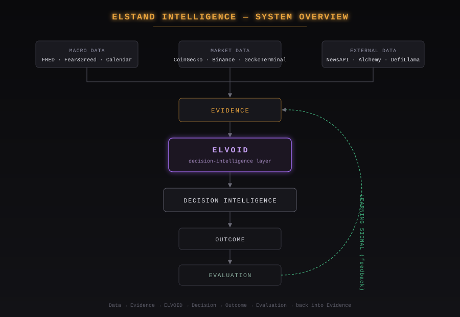
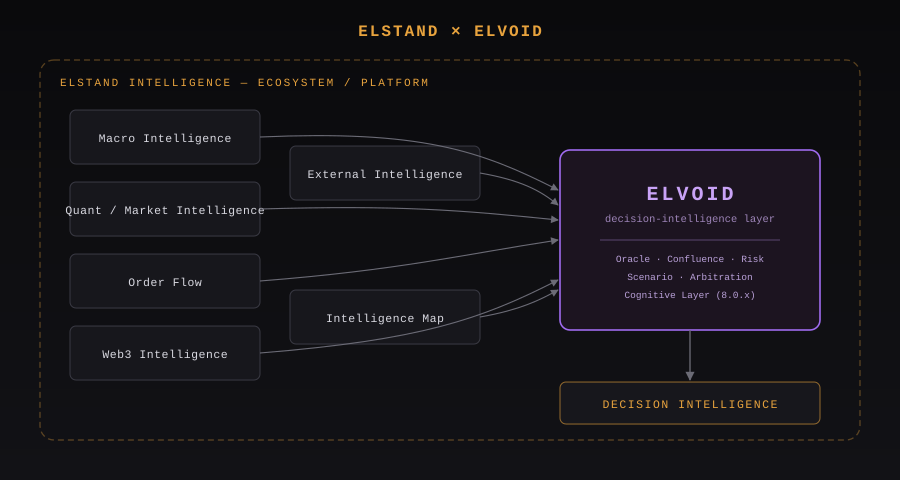
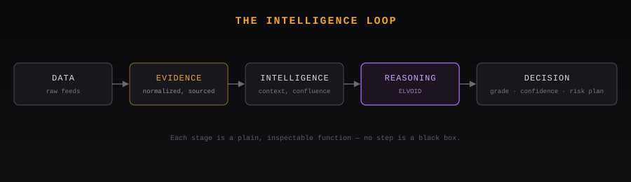
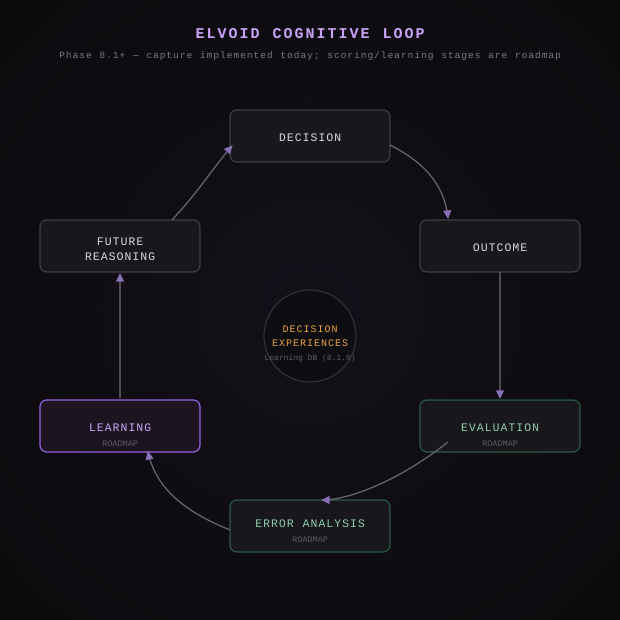

# ELSTAND Intelligence

**A crypto market intelligence ecosystem** that turns macro, market, order-flow,
on-chain, and news data into evidence, reasoning, and decision context —
with **ELVOID** as its decision-intelligence layer.



> ELSTAND Intelligence is an ecosystem, not a single trading bot. It does
> not guarantee profit or accuracy — see [Disclaimer](#disclaimer).

---

## What is ELSTAND Intelligence?

Most crypto tools show you a chart, a score, or a signal, with no visible
reasoning behind it. **ELSTAND Intelligence** is built around a different
premise: raw data on its own isn't useful — it becomes useful once it's
turned into *evidence*, weighed against other evidence, reasoned about, and
traced through to an outcome you can evaluate afterward.

ELSTAND aggregates macro data (FRED, Fear & Greed, economic calendar),
market data (CoinGecko, Binance, GeckoTerminal), order flow, and external
signals (news, whale transfers, DeFi TVL) into one evidence base. That
evidence base feeds **ELVOID**, the layer responsible for turning evidence
into a graded, risk-aware trading decision — with every step of that
reasoning inspectable, not a black box.

---

## ELSTAND × ELVOID

| | ELSTAND Intelligence | ELVOID |
|---|---|---|
| **What it is** | The ecosystem/platform | The decision-intelligence layer inside it |
| **Scope** | Macro, market, order flow, Web3, external data, membership, wallet, rewards | Oracle analysis, scenario/contradiction/arbitration, cognitive layer, decision evaluation & learning |
| **Output** | The full product surface (dashboards, journal, portfolio, wallet) | A single graded decision: side, confidence, risk plan |



ELVOID is **not** ELSTAND's whole product — it's the reasoning core inside
a larger platform that also handles data aggregation, paper trading,
membership, and the on-chain (BSC Testnet) token/wallet layer.

---

## The Intelligence Loop



| Stage | What happens |
|---|---|
| **Data** | Raw feeds pulled from market, macro, on-chain, and news sources |
| **Evidence** | Normalized, source-tagged, with an honest fallback if a source is unavailable — never a fabricated placeholder value |
| **Intelligence** | Cross-referenced for confluence and conflict across timeframes and sources |
| **Reasoning** | ELVOID's Oracle/Cognitive layer turns intelligence into a graded, explainable read |
| **Decision** | A side, confidence, risk plan, and grade — traceable back to the evidence behind it |
| **Outcome** | What actually happened once the decision was acted on (paper or live) |
| **Evaluation** | Whether that outcome matched the decision's own expectation |
| **Learning** | Evaluation results feed back into future evidence weighting (see [Implemented vs Roadmap](#implemented-vs-roadmap)) |

---

## Intelligence Ecosystem

Components that are actually present in the repository, each contributing
evidence into ELVOID:

| Component | Purpose | Input | Output |
|---|---|---|---|
| **Macro Intelligence** | Broad market regime context | FRED (DXY, M2), Fear & Greed, economic calendar | Macro bias/context tags |
| **Quant / Market Intelligence** | Price, volume, and derivatives context | CoinGecko, Binance (spot/futures), GeckoTerminal | Confluence inputs, market-state evidence |
| **Order Flow** | Footprint / CVD-style flow reads | Binance klines, order book, funding | Flow bias evidence |
| **Web3 Intelligence** | On-chain activity | Alchemy (whale transfers), DefiLlama (stablecoin supply) | Whale/liquidity evidence |
| **External Intelligence** | News and sentiment | NewsAPI.org | News sentiment tags, rugpull "negative press" flag |
| **Intelligence Map** | Cross-source view aggregating the above | All of the above | Unified evidence surface for ELVOID |
| **ELVOID** | Decision-intelligence layer | All evidence above | Graded trading decision |

---

## How ELVOID Works

ELVOID is a deterministic pipeline, not a single LLM call wrapped in a
prompt. High-level flow:

```
Market / Macro / External Evidence
        ↓
Evidence Normalization
        ↓
Context / Multi-Timeframe Analysis
        ↓
Confluence + Contradiction Detection
        ↓
Scenario + Risk Analysis
        ↓
Cognitive Layer (observation → hypotheses → conflict state)
        ↓
Decision Intelligence (grade, confidence, risk plan)
```

The Cognitive Layer is a **downstream, read-only observer** of the Oracle's
canonical decision — it reframes and cross-checks that decision, it never
overrides or duplicates it, and it never fabricates data if a source is
missing (it reports `degraded`/`unavailable` honestly instead).

An optional LLM narrative pass sits at the very end (Phase 7.9), turning
the already-computed decision into a plain-language explanation — the LLM
never determines the decision itself.

Full stage-by-stage detail (Phases 7.5–8.2.9): see
[`docs/ELVOID_COGNITIVE_LAYER.md`](./docs/ELVOID_COGNITIVE_LAYER.md).



---

## Evidence & Decision Trace

Every ELVOID decision is traceable back through the evidence that produced
it:

```
Evidence
   ↓
Supporting Factors      (confluence in favor)
   ↓
Contradicting Factors   (conflict/contradiction detected)
   ↓
Uncertainty / Risk      (LOW / MEDIUM / HIGH — never a fabricated number)
   ↓
Decision                (side, grade, confidence, risk plan)
   ↓
Outcome                 (captured once the decision resolves)
```

This is a design constraint, not a marketing claim: the Cognitive Conflict
Resolution stage (8.0.4) is explicitly built to answer "how coherent is
this reasoning right now," and every hypothesis the Cognitive layer
produces (8.0.3) carries an uncertainty *level*, never a numeric score
dressed up as false precision.

---

## Learning From Outcomes

**IMPLEMENTED**, wired end-to-end into the autonomous runtime:

```
Decision
   ↓
Outcome                     (captured — Phase 8.1.0, isolated Learning DB)
   ↓
Decision Evaluation         (Phase 8.1.1 — per-decision, no cross-decision inference)
   ↓
Failure Pattern Detection   (Phase 8.1.2 — frequency observations only, min. 5 occurrences)
   ↓
Adaptive Constraint Gen.    (Phase 8.1.4)
   ↓
Learning Validation         (Phase 8.1.5)
   ↓
Future Reasoning            (constraints feed back into subsequent Oracle cycles)
```

Orchestrated by `lib/ai/autonomousRuntime/learningRefresh.ts`, which
sequences the three recompute functions in the required order under the
same lock that guards the autonomous trading batch — a failure at any step
halts that run without deleting the previous successful snapshot. See
[`docs/ELVOID_COGNITIVE_LAYER.md`](./docs/ELVOID_COGNITIVE_LAYER.md) for
the full mechanism, including what's confirmed wired vs. what still needs
verification.

---

## Key Features

| Feature | Purpose | Status |
|---|---|---|
| Macro / Market / External data aggregation | Evidence base for ELVOID | IMPLEMENTED |
| ELVOID PRO Oracle (confluence, scenario, contradiction, arbitration, risk) | Graded trading decision | IMPLEMENTED |
| Cognitive Layer (observation, hypotheses, conflict state) | Explainable reasoning over the Oracle decision | IMPLEMENTED |
| Decision Outcome Capture + Learning DB | Persist decision-time snapshots, isolated from main DB | IMPLEMENTED |
| Decision Evaluation / Failure Pattern Detection / Adaptive Constraints / Learning Validation | Turn outcomes into future constraints | IMPLEMENTED |
| Autonomous background runtime (cron + GitHub Actions heartbeat) | Runs the pipeline per watchlist symbol without user action | IMPLEMENTED |
| Paper trading (journal, statistics) | Risk-free strategy validation | IMPLEMENTED |
| Live trading (Binance Spot/Futures Testnet or Live) | Real order execution | IMPLEMENTED |
| On-chain membership (ELVOID PRO / ELSTAND PREMIUM) via `ELSTestnetPayment` | Gated access paid in ELS | IMPLEMENTED |
| ELS token buy/sell, reward distributor, Bug Hunter escrow | Token utility on BSC Testnet | IMPLEMENTED |
| LLM narrative pass over the final decision | Plain-language explanation of an already-computed decision | IMPLEMENTED (optional) |
| Decision memory retrieval / autonomous-learning lifecycle wiring | Deeper self-improving learning loop | EXPERIMENTAL — present in code, scope needs verification before citing in a pitch |
| Cross-chain (beyond BSC) support | Wider Web3 reach | ROADMAP |

---

## Data & Intelligence Sources

| Source | Used for | API key required |
|---|---|---|
| CoinGecko | Market data, prices, market cap, 1h/24h/7d change | No |
| Binance Futures | Funding rate, open interest, OHLCV candles | No |
| Alternative.me | Fear & Greed index | No |
| GeckoTerminal | DEX volume, liquidity & FDV (ETH, BSC, Solana, Base, Arbitrum) | No |
| DefiLlama | Stablecoin supply market-overview | No |
| FRED (St. Louis Fed) | DXY (Broad USD Index proxy) & M2 money supply | Yes — free |
| Alchemy | Whale transfer feed (curated ERC-20 watchlist) | Yes — free tier |
| NewsAPI.org | News feed, sentiment, "negative press" rugpull flag | Yes — free tier (paid/GNews recommended for production) |
| ForexFactory calendar feed | Economic calendar (FOMC/CPI/NFP-style events) | No |
| Binance Spot/Futures (Testnet or Live) | Live Trading — real balance, positions, orders, execution | Yes — free Testnet key |

Disconnected or misconfigured sources fail honestly — the platform shows a
fallback state, never a fabricated placeholder value.

---

## Technical Architecture

```
External Data (Market / Macro / On-chain / News)
        ↓
Data Layer          (lib/binance, lib/*, API clients — fetch & cache)
        ↓
Evidence Layer       (normalization, honest fallback on source failure)
        ↓
Intelligence Layer   (confluence, order flow, macro/market/external context)
        ↓
ELVOID               (Oracle → Cognitive Layer)
        ↓
Decision / Risk       (grade, confidence, risk plan — lib/binance/risk-related modules)
        ↓
Outcome               (ai_journal, bn_orders_log, paper_wallet)
        ↓
Evaluation / Learning (isolated ELVOID Learning Database, Phase 8.1.x)
```

Dual/triple-Supabase design:

```
MAIN SUPABASE                MARKET DATA SUPABASE       ELVOID LEARNING DATABASE
(auth, users, journal,       (isolated market-data       (isolated decision_experiences
 wallet, membership)          project)                    projection — no cross-project FK)
```

---

## Tech Stack

| Layer | Technology |
|---|---|
| Framework | Next.js 14.2.5 (App Router), React 18.3.1 |
| Language | TypeScript 5.5.4 |
| Styling | Tailwind CSS 3.4.7, Framer Motion |
| Data / State | @tanstack/react-query |
| Charts | lightweight-charts |
| Backend / DB | Supabase (`@supabase/supabase-js`, `@supabase/ssr`) — Postgres + Row Level Security |
| Web3 | viem, wagmi, @reown/appkit (WalletConnect-based) |
| Scraping / parsing | cheerio (ForexFactory calendar feed) |
| Email | nodemailer |
| Deployment | Vercel |
| Chain | BNB Smart Chain Testnet (chainId 97) |

---

## API & Data Flow

Representative endpoints (not exhaustive — see `app/api/`):

| Component / Endpoint | Purpose | Input | Output |
|---|---|---|---|
| `POST /api/elvoid-pro/oracle` | Run the full Oracle → Cognitive pipeline for one symbol | Symbol, timeframe | Graded `OracleAssessment` + cognitive summary |
| `GET /api/elvoid-pro/autonomous/status` | Read the latest autonomous-runtime snapshot | Symbol/watchlist | `autonomous_intelligence_snapshot` row(s) |
| `POST /api/binance/order` | Place a live/testnet order | Symbol, side, size | Order confirmation, client order ID |
| `GET /api/binance/risk` | Current risk exposure read | Account/session | Risk status |
| `POST /api/ai-signals/scan` | Scan watchlist for signal candidates | Watchlist | Candidate signals |
| `GET /api/ai-performance/cognitive` | Read cognitive-layer performance/state | — | Cognitive summary |
| `POST /api/bug-hunter/report` | Submit a bug report against `BugBountyEscrow` | Report payload | On-chain escrow submission |

---

## Web3 / BNB Chain

ELSTAND uses BNB Smart Chain **Testnet** (chainId 97) for its token economy
and on-chain membership gating — chosen for low-cost testing of a
payment/membership flow before any mainnet commitment.

- **ELS Token** — fixed-supply (1,000,000,000) ERC-20 (OpenZeppelin v5),
  used for ELVOID PRO / ELSTAND PREMIUM membership payments, AI Energy
  purchases, and Bug Hunter rewards.
- **Utility**: pay for membership tiers (`ELVOID_PRO_WEEK`,
  `ELVOID_PRO_MONTH`), buy AI Energy, claim Bug Hunter bounties, swap/sell
  on the testnet DEX-style contracts below.

| Contract | Address | Used for |
|---|---|---|
| ELS Token | `0x4AeA3938eb5c5A594410Bf67c2F2107970901a4D` | Core ERC-20 |
| Testnet Faucet | `0x3a0664300EA06Ba7c01EDC9951c1b04BE9101C82` | Faucet claim flow |
| Reward Distributor | `0xdF06b4C5a77a9fbFB2400481e159fD0e223db739` | Swap → verify → claim reward pipeline |
| BugBountyEscrow | `0x305f5450042eD126Aa08e0E2C9740F46B1f3b7DB` | Bug Hunter submission/claim |
| ELSTestnetSwap | `0x5EB87767c2861eD345E068bbACB07d73C014751B` | Swap contract |
| ELSTestnetSell | `0x97A8EE8157C1fe62124c5fBD475b1282cB248D34` | Sell contract |
| ELSTestnetPayment | `0x576bba3714983B59d5440C8f6Bb7Dd048cf9628b` | Sole processor for PRO membership + AI Energy purchases |

Full detail: [`CONTRACTS.md`](./CONTRACTS.md).

> Note: **BSC Testnet** (token, membership, contracts) and **Binance
> Spot/Futures Testnet** (order execution API) are two separate systems —
> one is the blockchain the ELS token lives on, the other is the exchange
> API used for placing trades. They are not the same thing.

---

## Security & Integrity

- **Authentication**: Supabase Auth (Google OAuth), enforced in
  `middleware.ts` for all protected routes (`/dashboard`, `/trading`,
  `/portfolio`, `/settings`, etc.) — unauthenticated requests are
  redirected to `/login`.
- **Authorization / RLS**: Row Level Security is enabled on every
  sensitive table (`ai_signals`, `ai_journal`, `paper_wallet`,
  `bn_credentials`, `bn_orders_log`, `users`, `profiles`, `ai_token`, and
  more) with **zero public policies** — access requires the server-side
  service role key, never the browser's anon key. On tables with real
  per-user policies, a signed-in user can only see their own rows.
- **Exchange API key handling**: keys are read from server-only env vars
  by default; an optional database-stored alternative is encrypted at
  rest with **AES-256-GCM** (`ENCRYPTION_KEY`, server-only) so keys can be
  rotated from Settings without a redeploy.
- **Order safety**: every order gets a unique client order ID, a
  short double-submit cooldown, and a per-symbol in-process lock so two
  near-simultaneous requests can't double an entry.
- **Wallet security**: EVM wallet connect via Reown AppKit/wagmi —
  private keys never touch the server except where a server-signed
  transaction is explicitly required (e.g. reward distribution), and any
  MetaMask-exported key used server-side requires the `0x` prefix
  convention documented in code.
- **No fabricated data**: a disconnected or failing source shows an
  honest fallback state rather than a placeholder value — applied
  consistently across the codebase, not only in the Cognitive Layer.

---

## Implemented vs Roadmap

**IMPLEMENTED**
- Macro / Market / Order Flow / Web3 / External data aggregation
- ELVOID PRO Oracle (confluence, scenario, contradiction, arbitration, risk)
- Cognitive Layer (observation, working memory, hypotheses, conflict resolution, decision context)
- Decision Outcome Capture + isolated Learning Database
- Decision Evaluation, Failure Pattern Detection, Adaptive Constraint Generation, Learning Validation — orchestrated as a single learning-refresh sequence
- Autonomous background runtime (Vercel cron + GitHub Actions 15-minute heartbeat, lock-guarded against overlap)
- Paper trading (journal, statistics)
- Live trading via Binance Spot/Futures (Testnet or Live)
- On-chain membership gating (`premium_memberships`) paid via `ELSTestnetPayment`
- ELS token, faucet, reward distributor, Bug Hunter escrow — all deployed on BSC Testnet
- Optional LLM narrative pass over the final, already-computed decision

**EXPERIMENTAL**
- Decision memory retrieval and autonomous-learning lifecycle wiring — present in the codebase and referenced by the autonomous runtime, scope not yet independently verified end-to-end for this audit
- Vercel Hobby cron limitation means the daily platform cron alone would be insufficient; the GitHub Actions heartbeat is the real trigger in practice, worth understanding before assuming "runs every 15 minutes" out of the box on a fresh deploy

**ROADMAP**
- Mainnet deployment (all contracts currently BSC Testnet only)
- Cross-chain support beyond BNB Smart Chain
- Non-Vercel-Hobby-constrained scheduling for guaranteed full-watchlist coverage per tick

---

## Demo

NEEDS VERIFICATION — no demo link or video found in this repository.

---

## Repository

[github.com/standstillel-store/Elstand-intellegensi-](https://github.com/standstillel-store/Elstand-intellegensi-)

---

## Documentation

- [`docs/ELVOID_COGNITIVE_LAYER.md`](./docs/ELVOID_COGNITIVE_LAYER.md) — full Oracle/Cognitive/Learning pipeline deep-dive
- [`CONTRACTS.md`](./CONTRACTS.md) — deployed contract addresses (BSC Testnet)
- [`CHANGES.md`](./CHANGES.md) — phase-by-phase change history

---

## Smart Contracts

See the [Web3 / BNB Chain](#web3--bnb-chain) table above and
[`CONTRACTS.md`](./CONTRACTS.md) for the complete, source-of-truth address
list. All contracts are deployed on **BSC Testnet (chainId 97)** only —
none are on mainnet.

---

## Disclaimer

ELSTAND Intelligence is a research and decision-support platform. It
produces evidence, reasoning, and graded decision context — it does not
guarantee profit, accuracy, or any financial outcome. Live trading carries
real financial risk. Paper trading and Testnet contracts exist precisely
so the reasoning pipeline can be validated before any real capital is
involved.

