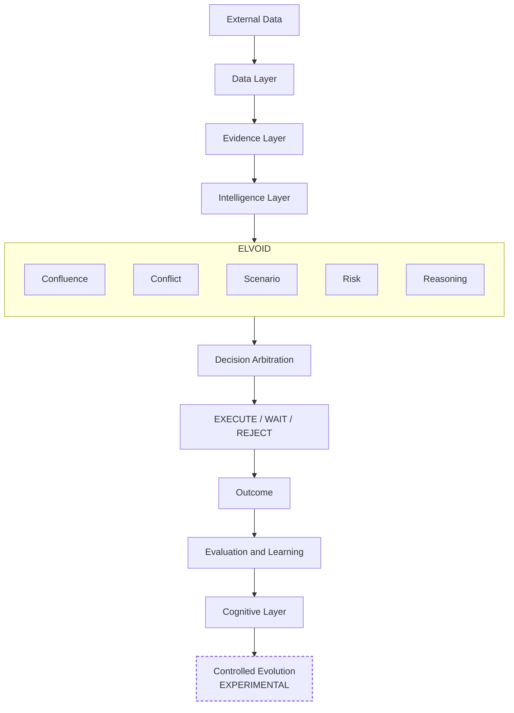
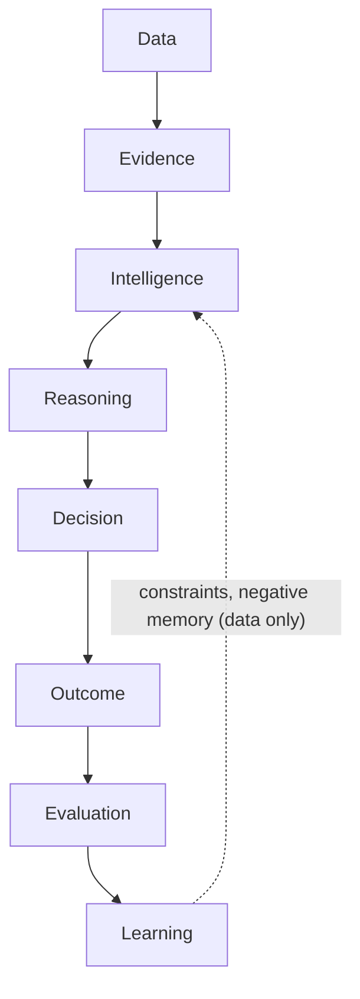
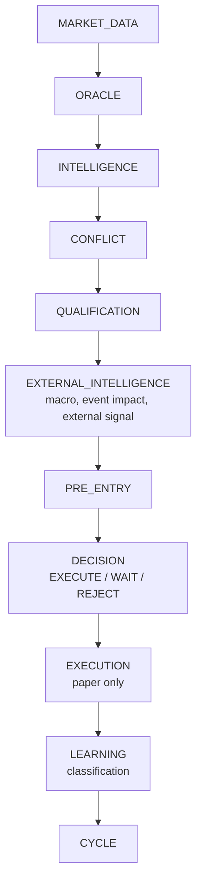
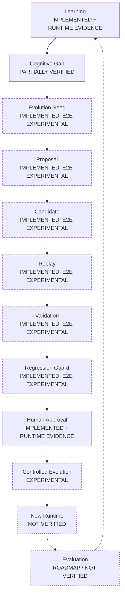
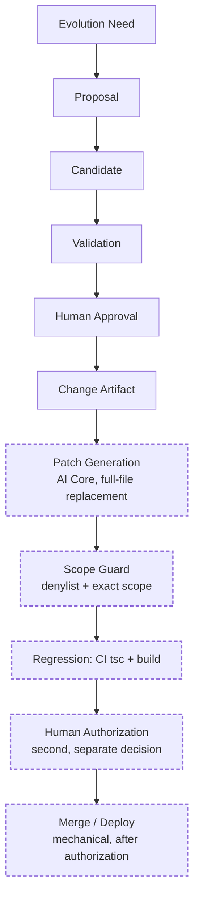
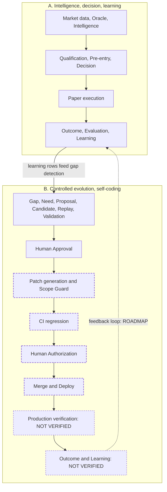
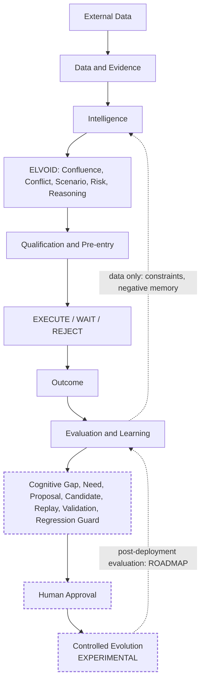

# ELVOID Cognitive Layer — Technical Deep Dive

| | |
|---|---|
| Baseline | `main` @ `b4ae428` — "Add Evolution Command Center" (2026-10-03) |
| What this is | How ELVOID turns evidence into a decision, learns from the outcome, and — experimentally — proposes controlled changes to itself |
| Companions | [`README.md`](../README.md) · [`CHANGES.md`](../CHANGES.md) (roadmap, §0 crosswalk) · [`docs/changelog/ENGINEERING_DELTA_LOG.md`](./changelog/ENGINEERING_DELTA_LOG.md) · the `/documentation` web page |
| Status words | Defined in [`CHANGES.md#status-legend`](../CHANGES.md#status-legend): IMPLEMENTED · VERIFIED · PARTIALLY VERIFIED · IMPLEMENTED + E2E/RUNTIME EVIDENCE AVAILABLE · EXPERIMENTAL · ROADMAP · BLOCKED · NOT VERIFIED |

## How to read this document

**Evidence tiers.** *E1* source (cited by path) · *E2* offline fixtures (reproducible; 66 files,
61 clean, 0 `FAIL`, 1,488 `PASS` lines, 5 BLOCKED) · *E3* **runtime evidence observed in the
AI Performance dashboard** (reported by the maintainer; no capture or log is stored in this
repository) · *E4* reproducible production evidence (none stored).

**Offline fixture verification ≠ live production E2E.** Fixtures show implementation-level
behaviour. Dashboard evidence shows the capability ran in the live runtime, but it cannot be
reproduced from this repository, so it is labelled *IMPLEMENTED + E2E/RUNTIME EVIDENCE
AVAILABLE*, not VERIFIED.

**Each section** states its purpose, its relation to ELVOID, the implementation with source
anchors, the verification status, and the limitation. Paths are repository-relative at the
baseline commit.

## Status at a glance

| Area | Status |
|---|---|
| ELVOID Core Intelligence | **IMPLEMENTED** |
| Decision Intelligence | **IMPLEMENTED + E2E/RUNTIME EVIDENCE AVAILABLE** |
| Outcome / Evaluation / Learning | **IMPLEMENTED + E2E/RUNTIME EVIDENCE AVAILABLE** |
| Cognitive Evolution (8.6.1–8.6.6) | **IMPLEMENTED / PARTIALLY VERIFIED** |
| Self-Improvement | **EXPERIMENTAL** |
| Self-Coding | **EXPERIMENTAL** |
| Full self-evolution E2E | **NOT YET VERIFIED** |
| 8.7+ Adaptive / Collective Intelligence | **ROADMAP** |

The end-to-end picture is split into two categories that this document never mixes:

- **A. Intelligence / decision / learning E2E** — implemented, with runtime evidence in the dashboard.
- **B. Controlled evolution / self-coding E2E** — architecture and individual gates implemented; a complete cycle in one continuous runtime has **not** been demonstrated. **EXPERIMENTAL.**

## From Phase 7 to the present

Phase 7 is the foundation of ELVOID Decision Intelligence. The rest is built on it, in this order:

```text
Phase 7   Evidence → MTF / market context → liquidity / order flow → scenario → conflict
          → arbitration → risk → reasoning → evaluation / calibration
Phase 8   Outcome → decision experience → evaluation → learning → cognitive gap
          → reasoning gap → evolution need
8.6       Evolution proposal → candidate → replay → validation → regression guard
          → human approval → controlled evolution
8.6.7     Self-improvement → self-coding → self-evolution   (controlled; experimental)
```

*Calibration note:* the only calibration-like element in source is the categorical
`confidenceAlignment` flag (`ALIGNED / MISALIGNED / UNKNOWN`) in decision evaluation; there is
no statistical calibration model.

*Terminology note:* identifiers such as `phase9`, `scripts/phase9/` and `elvoid/phase9/*` in
the code are **historical implementation labels**. On the roadmap they map to **8.6.7 —
Controlled Self-Improvement / Self-Coding / Self-Evolution**. There is no Phase 9, and no
identifier was renamed. See [`CHANGES.md` §0](../CHANGES.md#0-crosswalk--three-naming-systems).

## Contents

1. [Philosophy](#1-philosophy) · 2. [What Is ELVOID](#2-what-is-elvoid) · 3. [Problem](#3-problem) · 4. [Architecture](#4-architecture)
5. [Evidence Layer](#5-evidence-layer) · 6. [Intelligence Layer](#6-intelligence-layer) · 7. [Reasoning](#7-reasoning) · 8. [Conflict Intelligence](#8-conflict-intelligence) · 9. [Risk Intelligence](#9-risk-intelligence)
10. [Decision Arbitration](#10-decision-arbitration) · 11. [Decision Lifecycle](#11-decision-lifecycle) · 12. [Outcome Evaluation](#12-outcome-evaluation) · 13. [Learning](#13-learning)
14. [Cognitive Gap](#14-cognitive-gap) · 15. [Reasoning Gap](#15-reasoning-gap) · 16. [Evolution Need](#16-evolution-need) · 17. [Evolution Proposal](#17-evolution-proposal) · 18. [Candidate Generation](#18-candidate-generation)
19. [Replay Engine](#19-replay-engine) · 20. [Validation](#20-validation) · 21. [Regression Guard](#21-regression-guard) · 22. [Human Approval](#22-human-approval) · 23. [Controlled Evolution](#23-controlled-evolution)
24. [Self-Improvement](#24-self-improvement) · 25. [Self-Coding](#25-self-coding) · 26. [E2E Architecture](#26-e2e-architecture) · 27. [E2E Verification](#27-e2e-verification) · 28. [Production Verification](#28-production-verification)
29. [Security & Guardrails](#29-security--guardrails) · 30. [Known Limitations](#30-known-limitations) · 31. [Implemented / Experimental / Roadmap](#31-implemented--experimental--roadmap) · 32. [Final Architecture](#32-final-architecture)

---

## 1. Philosophy

**Purpose.** State the rules that every layer below obeys, so the later sections can be read
as consequences rather than features.

| Principle | In code |
|---|---|
| **Evidence before opinion.** A factor produces a number and a reason that references actually-detected features, not a boolean. | `lib/ai/oracle/confluenceTypes.ts` |
| **One canonical authority.** `gradeConfluence()` is the sole source of side, grade, confidence and risk status. Every later layer annotates; the language model only narrates and is never asked for numbers. | `lib/ai/oracle/grading.ts`, `arbitration.ts`, `reasoning.ts` |
| **Unavailable is not neutral.** A missing source carries no weight; a missing primary macro reading is `UNAVAILABLE`, never borrowed from a supporting source. | `lib/ai/oracle/confluence.ts`, `lib/economicData/primaryRelease.ts` |
| **Fail closed.** `decideAutonomous()` has no path that defaults to `EXECUTE`; the approval feature is off entirely if any of its three secrets is missing. | `lib/ai/autonomousDecision/decide.ts`, `lib/ai/evolutionApproval/security.ts` |
| **Explain the decision.** Closed status sets; gate signals are persisted per cycle; the cognitive trace is append-only and copies values verbatim. | `lib/ai/cognitiveTrace`, `autonomousRuntime/orchestrator.ts` (`P3`) |
| **Learning changes data, not code.** The learning refresh adds no detection or validation logic of its own; constraints are rows read under fixed rules. | `lib/ai/autonomousRuntime/learningRefresh.ts` |
| **ELVOID may look for ways to improve; it may not decide what "better" means.** Human stages and a `neverAutonomous` list are declared; validation gates are fixed engineering thresholds. | `lib/ai/evolutionPipeline/controlPolicy.yaml`, `evolutionValidation/gates.ts` |
| **Accuracy over marketing.** Statuses are earned by evidence; a design is never reported as an implementation. | this document, `CHANGES.md` |

**Relation to ELVOID.** These are the invariants that make the output a *decision* rather than a *signal*.
**Verification.** Principle-level; several are asserted by fixtures (for example, a fixture checks that
the novelty classifier contains no network, clock, randomness or model call). **Limitation.** They are
conventions enforced module by module, not a global type-system guarantee. **Status.** IMPLEMENTED.

## 2. What Is ELVOID

**Purpose.** Define the object being documented.

ELVOID is a **Decision Intelligence Engine**, not an AI signal generator. It connects

```text
Evidence → Context → Intelligence → Reasoning → Decision → Outcome → Learning
```

and produces a structured decision (`EXECUTE`, `WAIT` or `REJECT`) that carries a grade, a
confidence, a risk plan, scenarios, conflicts and a trace of why. Two surfaces exist: the standard
rule-based engine (`lib/elvoid/engine.ts`) and **ELVOID PRO** — the Oracle pipeline
(`lib/ai/oracle/*`) plus the autonomous runtime (`lib/ai/autonomousRuntime/*`).

**Relation to ELVOID.** This is ELVOID itself; the Cognitive Layer is the part that interprets,
remembers, traces and — experimentally — proposes changes.
**Implementation.** The autonomous runtime's only execution path is paper trading
(`lib/ai/autonomousExecution/execute.ts` → `lib/elvoid/paperTrader.ts`). The app separately offers
manual live trading through Binance (Testnet or Live); that path is not driven by ELVOID.
**Verification.** See §27. **Limitation.** Not financial advice; decisions are only as good as the
evidence available. **Status.** IMPLEMENTED + E2E/RUNTIME EVIDENCE AVAILABLE.

## 3. Problem

**Purpose.** Name the concrete problems the design answers, each with where the answer lives.

| Problem | Answer in the repository |
|---|---|
| A signal is a direction and a number; it cannot say what contradicts it or how it could fail. | Confluence per source, contradiction classifier, scenario, risk intelligence (`lib/ai/oracle/*`) |
| A blocked or waiting cycle could not be attributed to a gate (the source comment cites 1,007 such historical cycles). | `P3` persists qualification and pre-entry signals per cycle (`333ffb6`) |
| Closed decisions were never evaluated (the source comment cites 106 of 146, 72.6 %). | `autonomousRuntime/evaluationBacklog.ts` (8.5) |
| The macro reading was `UNKNOWN` for every snapshot because nothing read the primary data (source comment). | Alpha Vantage as primary source (`lib/economicData/primaryRelease.ts`, `af79566`) |
| A first self-coding pipeline merged and deployed right after generation. | Gate authorization, CI check and database trigger (`7e12508`) — see §25 |

The three figures marked *source comment* are production measurements quoted in code comments;
they are reported, not independently verified.

**Relation to ELVOID.** Each row is a place where a plain signal system fails silently.
**Verification.** E1 for the fixes; the measurements are not reproducible from the repository.
**Limitation.** The list covers problems that were observed and fixed, not every failure mode.
**Status.** IMPLEMENTED.

## 4. Architecture

**Purpose.** Show how the layers connect, and how a decision feeds back into learning.

### 4.1 ELVOID architecture map



<details><summary>Plain-text version</summary>

```text
External Data → Data Layer → Evidence Layer → Intelligence Layer
  → ELVOID [ Confluence | Conflict | Scenario | Risk | Reasoning ]
  → Decision Arbitration → EXECUTE / WAIT / REJECT → Outcome
  → Evaluation & Learning → Cognitive Layer → Controlled Evolution (EXPERIMENTAL)
```

</details>

"Decision Arbitration" in the map is two things in code: the Oracle's arbitration step
(`oracle/arbitration.ts`, 7.7) *annotates* alignment; the `EXECUTE / WAIT / REJECT` value comes from
`autonomousDecision/decide.ts` (8.2.6). See §10.

### 4.2 The intelligence loop



This is not only a conceptual diagram. The cycle runs in `lib/ai/autonomousRuntime/orchestrator.ts`,
and the dashboard's Runtime Terminal and Cognitive Map show the stages and the relations between
them (E3, reported). The feedback edge is real but narrow: learning produces *rows* (failure
patterns, adaptive constraints, validations) that qualification reads under fixed rules.

**Relation to ELVOID.** The map is ELVOID's whole reading of a market moment.
**Implementation.** Each box is a module; §5–§13 take them in order. **Verification.** §27.
**Limitation.** The diagram is a simplification; the emission order inside a cycle differs slightly
from the order shown (§11). **Status.** IMPLEMENTED + E2E/RUNTIME EVIDENCE AVAILABLE.

---

## 5. Evidence Layer

**Purpose.** Turn raw data into evidence that carries a number, a reason and a quality
(`real`, `proxy` or `unavailable`), so no later layer reads a raw feed.

**Relation to ELVOID.** Everything ELVOID concludes is built from this layer; a conclusion that
cannot cite evidence cannot exist.

**Implementation.**
- *Oracle evidence.* `lib/ai/oracle/dataAdapters.ts` assembles one `OracleContext` (read-only over
  `lib/binance`, `lib/elvoid/*`, `lib/intelligence/*`). `confluence.ts` scores LONG and SHORT
  independently per source and enforces: no hard-coded weight; **unavailable data → weight 0,
  quality "unavailable"**, never a neutral vote; proxy data capped by `PROXY_WEIGHT_CAP = 0.5`;
  internal conflict is recorded in `contradictions`, not averaged away. `oracle/evidence.ts` (7.1)
  is a thin read-only normalized view.
- *External evidence (8.4.x).* Source registry (`externalIntelligence/registry.ts`), Research
  Trigger (`researchTrigger/evaluate.ts`, decides but never fetches), Evidence Normalization
  (`evidence/normalize.ts`, `NormalizedExternalEvidence`), Community Intelligence (`community/`) and
  Altcoin Screener evidence (`screener/`). The live socket is
  `lib/ai/wiring/externalIntelligenceGate.ts`.
- *Economic evidence.* Alpha Vantage observations are the **primary** source
  (`lib/economicData/primaryRelease.ts`); FRED, ForexFactory and others are supporting and never
  replace or outrank it.

**Verification.** E2: `evidence-normalization` 42 · `research-trigger` 31 · `external-intelligence-gate`
34 · `community-intelligence` 28 · `alpha-vantage-primary` 46 PASS; **BLOCKED:** `altcoin-screener`,
`macro-ingestion-lock`. E3: External Intelligence on 15/15 pairs in the production runtime (reported).

**Limitation.** A source's `reliability` is provenance, not correctness. Community Intelligence has no
integrated source and reports honest unavailability. The one fetch path covers derivatives
capabilities only. **Status.** IMPLEMENTED + E2E/RUNTIME EVIDENCE AVAILABLE; Community Intelligence
EXPERIMENTAL.

## 6. Intelligence Layer

**Purpose.** Interpret evidence in context — market structure, economic environment, external
events — without changing the canonical assessment.

**Relation to ELVOID.** These layers decide whether a graded setup is *appropriate right now*; they
can annotate, block or caution it but never re-grade it.

**Implementation.**

| Layer | Anchor | Note |
|---|---|---|
| Multi-timeframe context (7.2) | `oracle/mtf.ts` | A descriptive relationship label — explicitly not a second direction |
| Regime-aware interpretation (7.3B) | `oracle/regime.ts` | Interprets the existing reading in its regime |
| Liquidity + order flow (7.4) | `oracle/liquidityOrderFlow.ts` | Liquidity zones, footprint, TPO and swing evidence |
| Macro intelligence (8.2.3) | `lib/ai/macroIntelligence/*` | Built from the primary source only; a missing or stale indicator contributes nothing and clusters degrade to `INSUFFICIENT_DATA` |
| Event impact (8.2.4) | `lib/ai/eventImpact/*` | `MarketImpactContext`; a throw becomes an `UNAVAILABLE` context (`economicIntelligence/failClosed.ts`) |
| External signal | `wiring/externalIntelligenceGate.ts` | Assembled before pre-entry validation |

**Verification.** E2: `mtf` 7 · `regime` 8 · `liquidity-orderflow` 16 · `macro-intelligence` 43 ·
`event-impact` 51 PASS. E3: the structure / liquidity and macro nodes of the Runtime Intelligence Graph
(reported). **Limitation.** Economic data refreshes on a daily cron, not in real time.
**Status.** IMPLEMENTED + E2E/RUNTIME EVIDENCE AVAILABLE.

## 7. Reasoning

**Purpose.** Compose evidence into an interpretation that can be read, challenged and traced,
without letting a language model decide anything.

**Relation to ELVOID.** Reasoning is where ELVOID states *why*; it never changes *what*.

**Implementation.** Three deterministic stages and one narrative stage:
1. `oracle/insight.ts` (Oracle phase 4) builds readable sections and named patterns, reusing the factor evidence strings.
2. Cognitive layer, all downstream and read-only: **Observation** (8.0.1), **Working Memory** (8.0.2, request-scoped, never persisted), **Hypotheses** (8.0.3, a thin reframing of scenario, contradiction and arbitration output), **Decision Context** (8.0.5, an assembly boundary, not a thinking layer).
3. `oracle/reasoning.ts` (7.9) is an optional narrative over the finished pipeline. It never decides: side, grade, confidence, risk status, invalidation and every price level are fixed before it runs, and it is never asked for numbers.

**Verification.** E2: `reasoning` 14 · `cognitive-observation` 10 · `cognitive-memory` 39 ·
`cognitive-hypothesis` 24 · `cognitive-context` 22 PASS. **Limitation.** The narrative is text; its
quality is not measured by any fixture. **Status.** IMPLEMENTED + E2E/RUNTIME EVIDENCE AVAILABLE for the
pipeline; the narrative's quality is NOT VERIFIED.

## 8. Conflict Intelligence

**Purpose.** Make disagreement visible and consequential instead of averaging it away.

**Relation to ELVOID.** Conflict can lower a decision from `EXECUTE` to `WAIT` or `REJECT`.

**Implementation.** Four distinct things that share the word "conflict":
1. *Confluence contradictions* — recorded per factor, not averaged (`oracle/confluence.ts`).
2. *Contradiction classifier* (7.6) — reclassifies contradiction-shaped evidence: severity `LOW / MODERATE / HIGH`; genuineness `GENUINE / DATA_GAP / SAME_CLUSTER`; exposes whether an unresolved genuine contradiction exists (`oracle/contradiction.ts`).
3. *Cognitive conflict resolution* (8.0.4) — a meta-layer asking "how coherent is the system's own interpretation", never "which direction is correct"; it reuses the 7.6 and 7.7 aggregates (`cognitive/conflict.ts`).
4. *Memory conflict* — qualification returns `CONFLICTED` when a negative-memory signal contradicts trusting the signal; the decision engine then returns `REJECT` (`decisionQualification/qualify.ts`, `autonomousDecision/decide.ts`). Pre-entry returns `BLOCKED` when qualification is conflicted or macro / event risk is elevated, and `CAUTION` for conflicting impact or conflicting external evidence.

**Verification.** E2: `contradiction` 8 · `cognitive-conflict` 18 · `decision-qualification` 40 ·
`pre-entry-validation` 25 PASS. E3: the `CONFLICT` and `QUALIFICATION` stages on 15 pairs (reported).
**Limitation.** Severity and genuineness are rule-based classifications; the negative-memory constants are
a provisional baseline (§30). **Status.** IMPLEMENTED + E2E/RUNTIME EVIDENCE AVAILABLE.

## 9. Risk Intelligence

**Purpose.** State how a setup could fail and whether the plan is valid, before any execution.

**Relation to ELVOID.** Risk can downgrade a decision (qualification `CAUTION`, pre-entry `CAUTION`) or
block it (pre-entry `BLOCKED` on elevated macro or event risk).

**Implementation.** `oracle/risk.ts` computes entry, stop, targets and risk-reward with the same method
as `lib/elvoid/engine.ts` (nearest protective support / resistance plus an ATR buffer); the grading engine
has its own Risk Validation step (`grading.ts`). `oracle/riskIntelligence.ts` (7.8) is a **descriptive,
read-only** interpretation of that plan: it computes no second plan and gates nothing. Gating happens in
qualification (`riskValid`) and pre-entry (`riskValid`, macro and event risk elevation).

**Verification.** E2: `risk-intelligence` 11 PASS plus the qualification and pre-entry fixtures.
E3: the `RISK` component and the risk node of the Runtime Intelligence Graph (reported).
**Limitation.** There is no portfolio-level risk model in this layer. **Status.** IMPLEMENTED + E2E/RUNTIME EVIDENCE AVAILABLE.

## 10. Decision Arbitration

**Purpose.** Separate *annotating* an assessment from *deciding* whether to act on it.

**Relation to ELVOID.** The name covers two steps; confusing them is the most common misreading.

**Implementation.**
- *Oracle arbitration* (`oracle/arbitration.ts`, 7.7) reads the already-fixed assessment and annotates
  alignment. It never recomputes or overrides side, grade, confidence or risk status.
- *The decision* (`autonomousDecision/decide.ts`, 8.2.6) applies this priority order — the first match
  wins:

| # | Condition | Result |
|---|---|---|
| 1 | Required context missing, or qualification / pre-entry insufficient | `WAIT` |
| 2 | Pre-entry `BLOCKED` | `REJECT` |
| 3 | Qualification `CONFLICTED` | `REJECT` |
| 4 | Pre-entry `CAUTION` | `WAIT` |
| 5 | Pre-entry `VALID` **and** qualification `QUALIFIED` | `EXECUTE` |
| 6 | Anything else | `WAIT` |

There is no path that defaults to `EXECUTE`. Qualification `CAUTION` is not handled by its own rule: it
simply fails rule 5 and falls to rule 6.

**Verification.** E2: `arbitration` 12 · `autonomous-decision` **25** PASS. E3: the `DECISION` stage on
15 pairs (reported). **Limitation.** The rule table is fixed code; changing it requires a human-reviewed
change (and `lib/ai/autonomousDecision/` is on the self-coding denylist, §29). **Status.** IMPLEMENTED +
E2E/RUNTIME EVIDENCE AVAILABLE.

## 11. Decision Lifecycle

**Purpose.** Define the stages a decision passes through, and how qualification, pre-entry, decision,
execution, outcome and learning relate.

**Relation to ELVOID.** The lifecycle is what the AI Performance dashboard's Runtime Terminal shows, one
event per stage that actually ran. It is **implemented**, not roadmap.

**Stage ladder as reported from the dashboard:**

```text
MARKET_DATA → ORACLE → CONFLICT → INTELLIGENCE → EXTERNAL_INTELLIGENCE → QUALIFICATION
→ PRE_ENTRY → DECISION → LEARNING → EXECUTION → CYCLE
```

**Emission order in source** (`lib/ai/autonomousRuntime/orchestrator.ts`, by line): `CYCLE` (196) →
`MARKET_DATA` (207) → `ORACLE` (294) → `INTELLIGENCE` (331) → `CONFLICT` (393) → `QUALIFICATION` (446) →
`EXTERNAL_INTELLIGENCE` (475, 488, 505) → `PRE_ENTRY` (540) → `DECISION` (588) → `EXECUTION` (611) →
`LEARNING` (630) → `CYCLE` (721). The two orders differ in three adjacent pairs — `INTELLIGENCE` /
`CONFLICT`, `QUALIFICATION` / `EXTERNAL_INTELLIGENCE`, and `EXECUTION` / `LEARNING`. The component list
also contains `RISK`. This document does not change either order; where precision matters, use the source
order. The `LEARNING` stage is a **classification** — whether this result will enter the learning
lifecycle on close (8.2.8) — emitted after execution.



**Implementation.** Statuses: qualification `QUALIFIED / CAUTION / CONFLICTED / INSUFFICIENT_CONTEXT`;
pre-entry `VALID / CAUTION / BLOCKED / INSUFFICIENT_CONTEXT`; decision `EXECUTE / WAIT / REJECT`;
execution `EXECUTED / SKIPPED_WAIT / SKIPPED_REJECT / SKIPPED_UNSUPPORTED_SOURCE / EXECUTION_FAILED`.
Qualification (`decisionQualification/qualify.ts`) asks whether the signal deserves trust (source
eligibility, canonical assessment, a qualifying grade, negative memory, risk validity, caution
constraints). Pre-entry (`preEntryValidation/validate.ts`) asks whether *now* is safe (macro and event
risk, conflicting impact, data completeness, external evidence). The decision combines them (§10).
Execution (`autonomousExecution/execute.ts`) has one fixed gate, `decision === "EXECUTE"`, and then
reuses `paperTrader.executeSignal()`. A duplicate-execution guard runs first (Step 6); the decision trace
is persisted internally for every outcome (Step 7). Outcome and learning follow on trade close (§12–§13).

**Verification.** E2: `decision-qualification` **40** · `pre-entry-validation` **25** ·
`autonomous-decision` **25** PASS; **BLOCKED:** `autonomous-paper-execution`, `autonomous-runtime`. E3: the
full autonomous pipeline on 15 pairs (reported). **Limitation.** The orchestrator has no
dependency-injection seam, so its end-to-end run has no offline test. **Status.** IMPLEMENTED + E2E/RUNTIME
EVIDENCE AVAILABLE.

## 12. Outcome Evaluation

**Purpose.** Judge whether a decision was sound and whether the market confirmed it; make the answer
available to learning.

**Relation to ELVOID.** This is the step that turns a decision into evidence about ELVOID itself.

**Implementation.** On a paper-trade close `lib/elvoid/paperTrader.ts` writes `ai_journal` first (the
canonical outcome authority), then starts `completeDecisionLearningLifecycle()` without awaiting it:
capture the outcome (`decisionOutcome`, 8.1.0), then evaluate (`decisionEvaluation`, 8.1.1), sequenced by
`decisionLearning/lifecycle.ts` (8.1.1.1) so two fire-and-forget calls cannot race. Two axes — decision
soundness at decision time, and what the market actually did — give an evaluation class, plus categorical
`confidenceAlignment` and `contextAlignment`. `autonomousRuntime/evaluationBacklog.ts` (8.5) retries
closed-but-unevaluated decisions in bounded batches under its own lock.

**Verification.** E2: `decision-outcome` 36 · `decision-evaluation` 36 · `decision-learning-lifecycle` 21 PASS.
E3: outcome → evaluation → learning feedback in the dashboard (reported). **Limitation.** Paper outcomes only;
the Learning DB write is best-effort and never blocks a close. **Status.** IMPLEMENTED + E2E/RUNTIME EVIDENCE
AVAILABLE.

## 13. Learning

**Purpose.** Convert evaluated outcomes into *data* that future qualification can read — failure patterns,
adaptive constraints, constraint validations and retrievable decision memory.

**Relation to ELVOID.** This closes the intelligence loop (§4.2) without letting learning touch code.

**Implementation.** After each close, `learningRefresh.ts` (8.2.9) recomputes, in this fixed order and
under a lock: failure patterns (`failurePatterns`, 8.1.2, `MIN_OCCURRENCE_COUNT` = 5) → adaptive constraints
(`adaptiveConstraint`, 8.1.4) → constraint validations (`learningValidation`, 8.1.5,
`FRESHNESS_WINDOW_DAYS` = 30). It adds no detection or validation logic. Every cycle, the orchestrator reads
decision memory (`queryDecisionMemory()`, Step 3, 8.1.3; a failed lookup returns `null`) and the validated
constraints; bounded negative memory (`P0`) can move qualification to `CONFLICTED` or `CAUTION` using fixed
constants (`NEGATIVE_MEMORY_MIN_OCCURRENCE_COUNT` = 5, `NEGATIVE_MEMORY_FRESHNESS_WINDOW_DAYS` = 30,
`NEGATIVE_MEMORY_DOMINANCE_SHARE_THRESHOLD` = 0.95).

**Verification.** E2: `failure-pattern` 16 · `decision-memory` 24 · `adaptive-constraint` 21 ·
`learning-validation` 27 · `autonomous-learning` 17 PASS (8.1.x family 198). E3: the learning-feedback node
and the decision-memory node of the Runtime Intelligence Graph (reported). **Limitation.** Influence on
decisions is narrow and bounded; the constants are marked **PROVISIONAL CALIBRATION BASELINE** in source.
**Status.** IMPLEMENTED + E2E/RUNTIME EVIDENCE AVAILABLE. The chain *outcome → learning → self-coding →
production improvement* is **not** shown end to end (§25–§28).

---

## 14. Cognitive Gap

**Purpose.** Detect *repeated, evidenced* weaknesses in how ELVOID reasons — never a single bad outcome.

**Relation to ELVOID.** This is the first step where ELVOID looks at itself: learning (§13) says what
happened; a cognitive gap says *where the reasoning keeps failing*.

**Implementation.** `lib/ai/cognitiveGap/detect.ts` (8.6.2) produces `CognitiveGap` records in six
categories — `CONTRADICTION_GAP`, `CONTEXT_GAP`, `REASONING_CONSISTENCY_GAP`,
`CONFIDENCE_ALIGNMENT_GAP`, `EVIDENCE_GAP`, `PATTERN_GAP`. Each needs at least `MIN_OCCURRENCE_COUNT`
(5) repeated occurrences. Severity (`LOW / MEDIUM / HIGH`) is deterministic and built from two existing conventions
(for example `occurrenceCount >= CONFIDENCE_SAMPLE_CAP`, 30, reused from another module), but the source
header flags the mapping itself as the one place in 8.6.2–8.6.4 that needed an original, documented judgment
call rather than pure reuse. `P1` (`decisionPopulation`,
`cognitiveGap/detectPopulationGap.ts`) adds a separate `REJECT_DOMINANCE_GAP` on its own
`populationGaps` field.

**Verification.** E2: `cognitive-gap` 19 · `decision-population` 44 PASS. E3: partial — assessed by the
maintainer as partial / current. **Limitation.** The severity rule is an engineering judgment, not a derived
statistic; `REJECT_DOMINANCE_GAP` is not yet fed into the evolution-need gate. **Status.** IMPLEMENTED +
**PARTIALLY VERIFIED.**

## 15. Reasoning Gap

**Purpose.** Isolate the part of the gap picture that concerns *reasoning* rather than data.

**Relation to ELVOID.** It lets the system say "the weakness is in how I interpret", separately from "the
weakness is that data was missing".

**Implementation.** `lib/ai/reasoningGap/derive.ts` (8.6.3 Part A) is a pure filter: it takes the
already-detected gaps from 8.6.2, keeps the fixed subset in `REASONING_GAP_CATEGORIES`, and attaches a
fixed, per-category statement. It never invents a category, never changes a severity and never re-counts
evidence.

**Verification.** E2: no dedicated fixture file; exercised by `evolution-need` (17) and `evolution-proposal`
(15) PASS. **Limitation.** The statements are fixed text, not explanations generated for the case at hand.
**Status.** IMPLEMENTED + PARTIALLY VERIFIED.

## 16. Evolution Need

**Purpose.** Decide whether an observed gap is strong enough to justify *proposing* an improvement —
never what the improvement should be.

**Relation to ELVOID.** It is the gate that stops weak or one-off evidence from starting a change.

**Implementation.** `lib/ai/evolutionNeed/evaluate.ts` (8.6.3 Part B) is a deterministic gate, not a score:

| Result | Meaning |
|---|---|
| `INSUFFICIENT_EVIDENCE` | Evaluation coverage itself is insufficient; gaps are not even inspected (coverage-first, conservative) |
| `NO_EVOLUTION_NEEDED` | Coverage is sufficient and no gap was detected |
| `MONITOR` | Gaps exist but none is HIGH and fewer than two categories are active — or a VALID constraint already addresses part of the evidence |
| `EVOLUTION_WARRANTED` | At least one HIGH gap, or two or more independently active categories, and no existing VALID constraint already covers the (source, symbol) pair |

"A single bad outcome must never trigger evolution" is enforced twice: each gap already needs the minimum
repeat count, and the gate additionally needs HIGH severity or two categories.

**Verification.** E2: `evolution-need` 17 PASS. **Limitation.** The thresholds are fixed values; the gate
does not see `REJECT_DOMINANCE_GAP`. **Status.** IMPLEMENTED + PARTIALLY VERIFIED.

## 17. Evolution Proposal

**Purpose.** Turn a warranted need into a *structured, reviewable statement* of what to change and why.

**Relation to ELVOID.** The proposal is text for a human and for the later pipeline, not a change.

**Implementation.** `lib/ai/evolutionProposal/propose.ts` (8.6.4) uses one fixed template per gap category,
filled only with numbers already present in the evidence — **no language model**. A proposal is persisted
through `app/api/ai-performance/proposals/persist/route.ts` into `evolution_proposals`. `lib/ai/selfEvaluation`
(8.6.4 Part A) composes an OBSERVED / INFERRED / UNKNOWN self-evaluation summary from already-computed
results. Only two category templates name a source file that the self-coding guard would currently allow
(§25).

**Verification.** E2: `evolution-proposal` 15 PASS (no dedicated `selfEvaluation` fixture). **Limitation.**
Proposals carry no counterfactual and no predicted effect. **Status.** IMPLEMENTED; end to end EXPERIMENTAL.

## 18. Candidate Generation

**Purpose.** Wrap a proposal so it can be *tested against history* without executing anything.

**Relation to ELVOID.** The candidate is the unit that replay (§19) and validation (§20) judge.

**Implementation.** `lib/ai/evolutionCandidate/create.ts` (8.6.5) builds an `EvolutionCandidate` with status
`CANDIDATE_CREATED / REPLAYING / REPLAY_PASSED / REPLAY_FAILED / VALIDATION_BLOCKED`. A defensive scope check
marks a candidate whose text strays out of scope `VALIDATION_BLOCKED`. A candidate **never contains
executable code, a diff or a patch** — only the proposal's structured fields plus the replay comparison.
`evolutionCandidate/monitoring.ts` offers a read-only monitoring view (`NO_ACTIVE_CANDIDATE` or
`MONITORING_UNAVAILABLE` rather than a fake pass).

**Verification.** E2: `evolution-candidate` 17 PASS. **Limitation.** "Candidate generation" here means
building a testable record, not generating code (code generation is §25). **Status.** IMPLEMENTED; end to
end EXPERIMENTAL.

## 19. Replay Engine

**Purpose.** Ask one honest question of a candidate: does the evidence for this gap still hold up, or was it
a one-off in an older window?

**Relation to ELVOID.** It is the only test a proposal receives before human review.

**Implementation.** `lib/ai/evolutionCandidate/replay.ts` is a **split-history replication check**. The same
pure 8.6.1 / 8.6.2 functions (`computeEvaluationCoverage`, `aggregatePerformance`, `detectCognitiveGaps`) run
twice — once on the older half and once on the newer half of the same historical (source, symbol)
population. The source's forensic audit note is explicit: the repository has **no execution engine that can
run a hypothetical modified rule against historical inputs**, and building one would mean writing and
executing candidate code, which 8.6.5 forbids. Every result is therefore marked
`OBSERVATIONAL_SPLIT_HISTORY` with `counterfactualAvailable: false` and a fixed list of
`missingCounterfactualInputs` (`evolutionCandidate/semantics.ts`). This is not the same module as
`lib/ai/cognitiveReplay` (8.3.7), a read-only reconstruction of a single recorded cycle.

**Verification.** E2: `evolution-candidate` 17 · `evolution-hardening` 38 · `cognitive-replay` 61 PASS.
**Limitation.** Replay cannot show that a change *would have* helped; it can only show the pattern persisted
or not. **Status.** IMPLEMENTED; end to end EXPERIMENTAL.

## 20. Validation

**Purpose.** Produce one auditable verdict per candidate, against fixed, stated thresholds.

**Relation to ELVOID.** The validation record is the *only* entry point to the human-approval and
self-coding stages.

**Implementation.** `lib/ai/evolutionValidation/validate.ts` (8.6.6) returns one of `VALID`, `INVALID`,
`INSUFFICIENT_EVIDENCE`, `INCONCLUSIVE` or `NOT_APPLICABLE` using an ordered decision table (an out-of-scope
candidate is `INVALID`; a category the replay cannot measure is `NOT_APPLICABLE`; a failed or truncated
replay is `INSUFFICIENT_EVIDENCE`; a detected regression is `INVALID` before any other evidence is
weighed). `gates.ts` fixes seven gates, all required for `VALID`: at least 20 eligible decisions in each
window; the target rate decreased; by at least 5 percentage points; and by at least 20 % of the older
window's rate; no newly active gap category; the regression axis was evaluated; it found none (exact integer
cross-multiplication, no floating point). `record.ts` and `recordRepository.ts` append an immutable record
keyed by `recordHash`.

**Verification.** E2: `evolution-validation` 15 · gates 33 · records 38 · hardening 38 PASS.
**Limitation.** The gates are engineering thresholds — **not** statistical significance, causal proof, or
evidence that a change is safe for production; `VALID` means only that the observational evidence cleared
them. **Status.** IMPLEMENTED + PARTIALLY VERIFIED; end to end EXPERIMENTAL.

## 21. Regression Guard

**Purpose.** Stop a change that fixes one weakness while creating another — and a code change that breaks the
build.

**Relation to ELVOID.** "Regression" means two different checks in this repository; both are guards, at
different stages.

| Guard | Where | What it checks | Evidence |
|---|---|---|---|
| Regression axis | 8.6.6, inside validation | In the newer window, **more** other gap categories are active, or **any newly** active category appears → `INVALID`, checked before the sample-size gate. `REGRESSION_CHECK_EVALUATED` and `NO_DETECTED_REGRESSION` are two of the seven gates. | E2 (validation fixtures) |
| CI test / regression | 8.6.7 `TEST_REGRESSION` | On the pushed branch, `phase9-patch-check.yml` runs `npx tsc --noEmit` and `npm run build`; `evolutionPipeline/checks.ts` polls the result for the exact commit. A missing or ambiguous result is never success. | Workflow present; live runs NOT VERIFIED |

**Limitation.** The CI guard is a type-check and a production build; it does **not** run the repository's
fixture suites, so it cannot show that decision behaviour is unchanged. **Status.** Regression axis:
IMPLEMENTED + PARTIALLY VERIFIED. CI guard: IMPLEMENTED; EXPERIMENTAL.

## 22. Human Approval

**Purpose.** Make a human the explicit authority before any change is drafted, and again before any merge.

**Relation to ELVOID.** This is where "ELVOID may not decide what better means" becomes mechanical.

**Implementation.** `lib/ai/evolutionApproval/*` (8.6.7). Eligibility accepts only a validation record whose
result is `VALID`. A Telegram message carries Approve / Reject; the webhook
(`app/api/ai-performance/approvals/telegram/route.ts`) hands the press to a state machine. The approver is
identified by a **numeric Telegram user id**, the webhook secret is compared in constant time, and the whole
feature is off if any of `TELEGRAM_BOT_TOKEN`, `TELEGRAM_APPROVER_ID` or `TELEGRAM_WEBHOOK_SECRET` is
missing (`evolutionApproval/security.ts`). `evolution_approvals.record_hash` is unique, so a record can be
decided exactly once and a redelivered press is idempotent. Approval is **not** deploy, activate or production
(Delta Log, Part 1). A *second*, separate decision — human authorization — is required after CI (§25).

**Verification.** E2: `evolution-approval` 82 + `evolution-approval-mutation` 43 = 125 PASS. E3: Telegram
approval and rejection, duplicate-callback handling and idempotency observed working (reported).
**Limitation.** One approver, by design; the Telegram channel is a single point of control.
**Status.** IMPLEMENTED + E2E/RUNTIME EVIDENCE AVAILABLE.

## 23. Controlled Evolution

**Purpose.** Show the whole loop from learning to a (possible) new runtime, and where each part stands.

**Relation to ELVOID.** The loop continues the intelligence loop (§4.2): learning feeds gap detection, and an
approved change would feed a new runtime that must be evaluated again.



**Implementation.** The *current intelligence / learning loop* is **IMPLEMENTED + E2E/RUNTIME EVIDENCE
AVAILABLE**. The *evolution continuation* is **EXPERIMENTAL**: each box up to Regression Guard is implemented
and fixture-tested (8.6.1–8.6.6, 226 PASS) but has not been exercised in one continuous runtime. The Evolution
Command Center (`lib/ai/evolutionCommandCenter/*`, `components/ai-performance/cognitive/EvolutionCommandCenter.tsx`)
is a strict, read-only ladder over what the real pipeline already produced — `OBSERVE → GAP → EVIDENCE →
PROPOSAL → PERSIST → CANDIDATE → VALIDATION → REGRESSION → READY → HUMAN_APPROVAL → CHANGE_ARTIFACT` — in
which a stage is reached only if every earlier one is. It ends at `CHANGE_ARTIFACT`; it does not display
patch, CI, authorization or deploy.

**Verification.** E2 as stated; E3 only for Human Approval and the intelligence loop. **Limitation.** The
dotted edges (`New Runtime → Evaluation → Learning`) are **not implemented**; see §28. **Status.**
**EXPERIMENTAL** (evolution continuation); cognitive evolution as implemented components **IMPLEMENTED /
PARTIALLY VERIFIED**.

## 24. Self-Improvement

**Purpose.** Describe self-improvement as a *controlled mechanism*, not unrestricted self-modification.

**Relation to ELVOID.** ELVOID may search for ways to get better; it may not decide what "better" means and
may not apply a change on its own authority.

```text
Learning → Detect Gap → Evaluate Need → Propose Improvement → Generate Candidate → Replay → Validate
→ Regression Guard → Human Approval → Controlled Change → New Runtime → Evaluate Again
```

An improvement must have evidence, have a proposal, pass validation, pass the regression guard, receive human
authorization, and be traceable.

| Step | Anchor | Status |
|---|---|---|
| Learning → Detect Gap → Evaluate Need | §13–§16 | IMPLEMENTED + PARTIALLY VERIFIED |
| Propose → Candidate → Replay → Validate → Regression Guard | §17–§21 | IMPLEMENTED; E2E EXPERIMENTAL |
| Human Approval | §22 | IMPLEMENTED + E2E/RUNTIME EVIDENCE AVAILABLE |
| Controlled Change | §25 | IMPLEMENTED; EXPERIMENTAL |
| New Runtime → Evaluate Again | none | ROADMAP / NOT VERIFIED |

**Verification.** As per the rows. **Limitation.** The final step — measuring whether the change improved
decisions — does not exist in code, so "self-improvement" is, today, controlled *change generation*, not a
closed improvement loop. **Status.** **EXPERIMENTAL.**

## 25. Self-Coding

**Purpose.** Let ELVOID turn an approved, validated need into a *proposed code change* — under hard limits.

**Relation to ELVOID.** It is the most advanced part of the Cognitive Evolution track (roadmap 8.6.7); the
repository's historical label for it is "Phase 9".



**Implementation.**
- `evolutionArtifact` builds a change artifact only from a `VALID` record whose approval hash matches;
  `affectedFiles` is a fixed regular expression over the proposal text, never inferred by a model.
- `evolutionCoding/generate.ts` makes one AI Core call that returns **full-file replacements** for the named
  files (`NOT_CONFIGURED`, `NO_AFFECTED_FILES_SCOPE`, `INVALID_RESPONSE`, `SCOPE_VIOLATION` or `GENERATED`);
  `scopeGuard.ts` then enforces the allowlist and denylists (§29).
- `evolutionGit/pushChange.ts` creates the branch `elvoid/phase9/<recordHash[:16]>` and stops there.
  `.github/workflows/phase9-patch-check.yml` runs the CI regression on that branch;
  `evolutionPipeline/checks.ts` records the result (`BRANCH_PUSHED_AWAITING_CHECKS`, `CHECKS_FAILED`,
  `CHECKS_TIMEOUT`, `AWAITING_HUMAN_AUTHORIZATION`).
- `evolutionPipeline/authorization.ts` is the **only** caller of the merge: after CI success a *second*
  Telegram decision is required, claimed atomically so one press wins. A migration trigger refuses any
  merge-or-deploy status without `authorized_by` and `authorized_at`.

**What may and may not be said.**
- An LLM-generated patch is **not** unrestricted autonomous production mutation. Production change requires
  explicit human authorization.
- `controlPolicy.yaml` labels `MERGE_DEPLOY` as `control: autonomous` while `autonomy.neverAutonomous` lists
  `production_merge` and `production_deploy`. The YAML does not reconcile them; this document documents both and
  does not edit the file (runtime unchanged). The accurate reading is **"Mechanically executable after
  explicit human authorization."** It is **not** "fully autonomous production deployment".
- *Scope reality (read from source; no fixture asserts it):* `CONTRADICTION_GAP` names
  `lib/ai/cognitive/conflict.ts` and `REASONING_CONSISTENCY_GAP` names `lib/ai/cognitive/hypothesis.ts` — the
  only two categories whose proposals currently yield a patchable, non-denylisted scope. `CONTEXT_GAP`,
  `CONFIDENCE_ALIGNMENT_GAP`, `EVIDENCE_GAP` and `PATTERN_GAP` name no path (`NO_AFFECTED_FILES_SCOPE`);
  `REJECT_DOMINANCE_GAP` names a denylisted decision-gate file.
- The P4 artifact's own status text says "Awaiting a human-authored patch"; the current pipeline can use a
  model-generated patch instead, within the limits above.

**Historical gate limitation.** Before commit `7e12508` (2026-09-28) a run could merge and trigger a deploy
immediately after code generation — recorded in the Delta Log as "full auto to production, single Telegram
APPROVE as final authorization", with no pre-merge `tsc` or `next build`, and never run against real GitHub,
Vercel or AI Core credentials. `7e12508` introduced the current model (stop at a pushed branch, require a CI
result for that commit, require a second human authorization, extend the denylist to the gating machinery, add
the database trigger). **The current authorization model did not exist for the first version of the
pipeline.**

**Verification.** E2: `evolution-coding` 11 · `evolution-git-and-pipeline` 12 · `evolution-artifact` 21 PASS.
**BLOCKED:** `controlled-autonomy-and-economic` (needs `js-yaml`) — the fixture for the CI-gate and
authorization path. No E3 evidence for patch generation, merge or deploy. **Limitation.** See §28 and §30.
**Status.** Architecture **IMPLEMENTED**; self-coding **EXPERIMENTAL.**

---

## 26. E2E Architecture

**Purpose.** Define "end to end" precisely, because the repository contains two different end-to-end
claims that must not be merged.

**Relation to ELVOID.** Category A is ELVOID operating; category B is ELVOID proposing changes to itself.



| | A. Intelligence / decision / learning | B. Controlled evolution / self-coding |
|---|---|---|
| Architecture | Implemented | Implemented |
| Individual components | Implemented, fixture-tested | Implemented, fixture-tested (authorization path BLOCKED offline) |
| Continuous runtime evidence | **Available** — observed in the AI Performance dashboard (reported) | **None** for a complete cycle; Telegram approval boundary only (reported) |
| Status | **IMPLEMENTED + E2E/RUNTIME EVIDENCE AVAILABLE** | **EXPERIMENTAL** |

The edge from learning into gap detection is a data path that exists in code. Everything after Human
Approval has no continuous-runtime evidence, and the return edge from a new runtime back to evaluation
does not exist.

**Verification.** §27. **Limitation.** The diagram shows intent and implemented paths together; the dashed and
dotted styling marks what is experimental or roadmap. **Status.** See the table.

## 27. E2E Verification

**Purpose.** State exactly what was run, what passed, what was blocked, and what each result does and does not
prove.

**Relation to ELVOID.** Offline fixtures prove implementation-level behaviour; they are **not** live E2E.

### 27.1 Offline fixtures (reproducible, E2)

Run read-only with Node 22, no `node_modules`, no network: `node --experimental-strip-types --loader
./scripts/phase7/alias-loader.mjs <file>`.

**66 fixture files · 61 clean · 0 `FAIL` · 1,488 `PASS` lines · 5 BLOCKED.**

| Folder | Files | Clean | `PASS` |
|---|---|---|---|
| `scripts/phase7` | 9 | 9 | 89 |
| `scripts/phase8` | 51 | 48 | 1,301 |
| `scripts/phase9` | 6 | 4 | 98 |

| Family (grouped by file name) | `PASS` | Note |
|---|---|---|
| Oracle 7.x | 89 | 8 assertion files + the 7.0 baseline script |
| Cognitive 8.0.x | 113 | |
| Learning 8.1.x | 198 | |
| Decision path 8.2.x | 292 | 2 BLOCKED (`autonomous-paper-execution`, `autonomous-runtime`) |
| Cognitive + external 8.3 / 8.4 | 263 | 1 BLOCKED (`altcoin-screener`) |
| Evolution 8.6.1–8.6.6 | 226 | |
| Approval + artifact (8.6.7) | 146 | |
| `phase9` folder | 98 | `evolution-coding` 11, `evolution-git-and-pipeline` 12, `alpha-vantage-primary` 46, `intelligence-evolution` 29; 2 BLOCKED |
| Other | 63 | `evidence-normalization` 42, `learning-db-env` 13, `symbol-isolation` 8 |

**BLOCKED — a missing package, not a pass and not a failure:**
four fixtures need `@supabase/supabase-js` — `altcoin-screener`, `autonomous-paper-execution`,
`autonomous-runtime`, `macro-ingestion-lock`; one needs `js-yaml` — `controlled-autonomy-and-economic`
(which covers the CI-gate / authorization path). They are **BLOCKED**, never PASS.

### 27.2 Runtime evidence observed in the AI Performance dashboard (E3)

Reported by the maintainer; **not stored in this repository**; no number below is derived from it by this
document. External Intelligence on 15/15 pairs in the production runtime; the full autonomous pipeline on
15 pairs; the approval boundary (Telegram approve / reject, duplicate-callback handling, idempotency); the
Runtime Intelligence Graph — the nine nodes of `lib/ai/cognitiveMap/registry.ts`: Market Data, Macro
Intelligence, Structure & Liquidity, Oracle, Risk Engine, Decision Memory, Autonomous Decision, Paper Trade
Execution, Learning Feedback. No screenshot or export is in the repository's documentation assets, so none is
embedded.

### 27.3 Verification matrix

| Capability | Implementation | Fixture | Runtime / E2E | Status |
|---|---|---|---|---|
| Phase 7 Intelligence | YES | YES (89) | Dashboard (reported) | IMPLEMENTED + E2E/RUNTIME EVIDENCE AVAILABLE |
| External Intelligence | YES | YES (34 · 42 · 31) | 15/15 pairs (reported) | IMPLEMENTED + E2E/RUNTIME EVIDENCE AVAILABLE |
| Autonomous Pipeline | YES | PARTIAL (context 22, decision 25; runtime and paper-execution BLOCKED) | 15 pairs (reported) | IMPLEMENTED + E2E/RUNTIME EVIDENCE AVAILABLE |
| Qualification | YES | **40/40** | YES (reported) | IMPLEMENTED + E2E/RUNTIME EVIDENCE AVAILABLE |
| Pre-entry | YES | **25/25** | YES (reported) | IMPLEMENTED + E2E/RUNTIME EVIDENCE AVAILABLE |
| Autonomous Decision | YES | **25/25** | YES (reported) | IMPLEMENTED + E2E/RUNTIME EVIDENCE AVAILABLE |
| Learning Loop | YES | YES (198) | Dashboard (reported) | IMPLEMENTED + E2E/RUNTIME EVIDENCE AVAILABLE |
| Cognitive Gap | YES | YES (19; population 44) | Partial / current | PARTIALLY VERIFIED |
| Evolution Proposal | YES | YES (15) | No full E2E | EXPERIMENTAL |
| Candidate | YES | YES (17) | No full E2E | EXPERIMENTAL |
| Replay | YES | YES (17 + 38) | No full E2E | EXPERIMENTAL |
| Validation | YES | YES (15 + 33 + 38) | No full E2E | EXPERIMENTAL |
| Regression Guard | YES | YES (inside validation) | No full E2E | EXPERIMENTAL |
| Human Approval | YES | YES (125) | Telegram proven (reported) | IMPLEMENTED + E2E/RUNTIME EVIDENCE AVAILABLE |
| Self-Coding | YES | YES (11 + 21) | No full E2E | EXPERIMENTAL |
| Merge / Deploy (evolution) | YES | PARTIAL (12; authorization path BLOCKED) | No full E2E | EXPERIMENTAL |
| Production Verification (evolution) | PARTIAL (build-level webhook only) | — | No full evolution E2E | NOT VERIFIED |
| Full Self-Evolution | Architecture | PARTIAL | NO | EXPERIMENTAL — full E2E NOT YET VERIFIED |

**Reading the matrix.**
- The stronger word VERIFIED is **withheld** where the evidence is runtime evidence that is not stored here;
  the fixture counts for qualification, pre-entry and decision (40 / 25 / 25) *are* reproducible.
- For the evolution rows the status is the **end-to-end** status. At the implementation and fixture level the
  same components are IMPLEMENTED + PARTIALLY VERIFIED ([`CHANGES.md`](../CHANGES.md)); the two are consistent
  — implemented and fixture-tested, but not exercised in one continuous runtime.
- The `INSUFFICIENT_EVIDENCE` and `NOT_APPLICABLE` validation results are normal outputs, not failures.

**Limitation.** Nothing in this section is a statement about profitability, accuracy of predictions, or
live-trading performance. **Status.** See the matrix.

## 28. Production Verification

**Purpose.** Separate what is established about the production runtime from what is not.

**A. Current intelligence runtime.** **IMPLEMENTED + production runtime evidence available** (reported):
External Intelligence 15/15, the full autonomous pipeline on 15 pairs, the approval boundary and the Runtime
Intelligence Graph. The evidence is dashboard-observed and is not stored here, so it is not reproducible from
the repository.

**B. Evolution production verification.** **NOT YET FULLY VERIFIED.** There is not enough evidence to say one
complete evolution cycle has succeeded:

```text
candidate → approval → self-code → merge → deploy → production verification → outcome → learning
```

This document invents no deployment ID, commit, log or production result. In this repository snapshot no commit
in `main`'s history carries a pipeline branch name (`elvoid/phase9/*`), and the only deployment-level logic is a
webhook that records a Vercel deployment's terminal state (`READY`, `ERROR`, `CANCELED`). That is build-level
verification; it does not evaluate whether a change improved decisions (**ROADMAP / NOT VERIFIED**).

| | Status |
|---|---|
| Current production intelligence runtime | IMPLEMENTED + production runtime evidence available (reported) |
| Evolution production verification | NOT YET FULLY VERIFIED |
| Reproducible production evidence in this repository | **BLOCKED / NOT VERIFIED** until stored |

*What would change this:* dated dashboard captures or an export of runtime events
(`/api/elvoid-pro/runtime-events`) stored in the repository for category A; for category B, stored rows or logs
from one complete cycle (for example the `evolution_patch_runs` row, the GitHub Actions run of
`phase9-patch-check`, the Vercel deployment record and the merge commit). These are examples of what would
count, not claims that any exists.

**Limitation.** Absence of evidence here is absence from the repository, not proof of absence in production.
**Status.** As tabled.

## 29. Security & Guardrails

**Purpose.** List the controls that bound self-coding and approval, honestly, including their limits.

**Relation to ELVOID.** These make "controlled" mean something enforceable rather than aspirational.

| Guard | Where | Enforces | Limit |
|---|---|---|---|
| `scopeGuard` | `lib/ai/evolutionCoding/scopeGuard.ts` | Each generated path must equal one of the artifact's `affectedFiles`; no path traversal; a path denylist that wins over the allowlist; a content denylist (`eval(`, `new Function(`, `child_process`, and the names of the four secrets) | The denylist does not enumerate every decision-relevant module (for example `lib/ai/oracle/*`, `lib/elvoid/*`); scope is in practice limited by the proposal templates |
| Path denylist | same | Includes `evolutionApproval/`, `evolutionPipeline/`, `evolutionGit/`, `evolutionDeploy/`, `evolutionCoding/`, `app/api/ai-performance/approvals/`, `app/api/ai-performance/evolution/`, `.github/`, `controlPolicy`, `supabase/learning/migrations/`, and the decision modules `decisionQualification/`, `decisionOutcome/`, `preEntryValidation/`, `autonomousExecution/`, `autonomousDecision/` | Gating-machinery entries were added on 2026-09-28; they did not exist for the first pipeline version |
| `controlPolicy.yaml` | `lib/ai/evolutionPipeline/` | Declares stage owners and a `neverAutonomous` list (`scope_expansion`, `denylist_override`, `approval`, `authorization`, `production_merge`, `production_deploy`, `secret_access`, `risk_gate`, `decision_gate`); parsed with `js-yaml` safe load and shape-checked | It is data: its header states enforcement lives in code and the database. Its `MERGE_DEPLOY: autonomous` label is not reconciled with the list (§25) |
| Database authorization trigger | `supabase/learning/migrations/2026-09f-…guard.sql` | A row cannot reach `PUSH_SUCCESS_DEPLOY_PENDING` or `DEPLOY_*` without `authorized_by` and `authorized_at`, which cannot later change | A consistency guard on one table, not a GitHub permission boundary; a schema owner can drop it; applied state NOT VERIFIED |
| Human approval and authorization | `lib/ai/evolutionApproval/*`, `evolutionPipeline/authorization.ts` | One approver by numeric Telegram id; webhook secret in constant time; config fails closed; two separate decisions; atomic claim; secrets redacted from output | A single approver channel |
| Regression testing | 8.6.6 regression axis; `phase9-patch-check.yml` | Rejects a candidate that activates other gap categories; CI runs `tsc --noEmit` and `npm run build` on the pushed commit | CI does not run the fixture suites; `next build` was not run in the audit |
| Cron callers | `phase9-checks-poll.yml`, `elvoid-autonomous-tick.yml` | Call the app with a bearer secret; the checks route refuses without `CRON_SECRET` | Cadence relies on GitHub Actions; no run log is stored here |
| Fail-closed defaults | `decide.ts`, `economicIntelligence/failClosed.ts`, `generate.ts` (`NOT_CONFIGURED`) | No default `EXECUTE`; a missing primary macro reading is `UNAVAILABLE`; no AI Core configuration yields `NOT_CONFIGURED` | Defaults protect only the paths that use them |

**Verification.** E2: `evolution-coding` 11 · `evolution-approval` 125 · `evolution-git-and-pipeline` 12
PASS; **BLOCKED:** the CI-gate and authorization fixture. **Status.** IMPLEMENTED; effectiveness in
production NOT VERIFIED.

## 30. Known Limitations

1. **Offline ≠ live.** Fixtures are implementation evidence; the runtime evidence is reported and not stored here.
2. **Five fixtures BLOCKED offline**, including the orchestrator (`autonomous-runtime`) and the CI-gate /
   authorization path (`controlled-autonomy-and-economic`).
3. **No repository workflow runs the fixture suites**; the only `tsc` / `build` workflow triggers on
   `elvoid/phase9/**` pushes; `next build` was not run in the audit.
4. **Provisional constants.** The negative-memory thresholds (5 occurrences, 30 days, 0.95 share) are marked
   "PROVISIONAL CALIBRATION BASELINE" in source; the gap-severity mapping is a documented judgment call.
5. **No calibration model.** `confidenceAlignment` is categorical; there is no statistical calibration.
6. **Replay is observational.** No counterfactual re-execution exists, by design.
7. **Validation gates are thresholds**, not proof of improvement or safety.
8. **Community Intelligence** has no integrated source; economic data is a daily snapshot; the external fetch
   path covers derivatives capabilities only.
9. **Self-coding scope is narrow** and bounded by proposal templates, not a complete denylist; the artifact
   status text still says "Awaiting a human-authored patch".
10. **Historical gate.** Before `7e12508` a pipeline run could merge and deploy right after generation; the
    current gate did not always exist.
11. **No post-deployment evaluation or feedback loop** (ROADMAP / NOT VERIFIED).
12. **No complete evolution cycle** has evidence; production verification of an evolution is NOT YET VERIFIED.
13. **The `LEARNING` stage is a classification**, and the stage order in the dashboard ladder differs from the
    emission order in source in three adjacent pairs (§11).
14. **Documentation drift risk.** Several code comments predate decisions (`fredProvider.ts`, `oracleMacro.ts`)
    and were left unchanged.

## 31. Implemented / Experimental / Roadmap

| Status | Capabilities |
|---|---|
| **IMPLEMENTED + E2E/RUNTIME EVIDENCE AVAILABLE** | Phase 7 Oracle intelligence · External Intelligence (15/15 reported) · Autonomous pipeline (15 pairs reported) · Qualification · Pre-entry · Autonomous Decision · Outcome / Evaluation / Learning loop · Human Approval boundary |
| **IMPLEMENTED + PARTIALLY VERIFIED** | Cognitive layer 8.0.x / 8.3.x · Traceability (trace, replay, causal graph, attribution) · 8.6.1–8.6.6 components (implementation and fixture level) · Cognitive Gap (PARTIALLY VERIFIED) |
| **IMPLEMENTED (code path)** | Change artifact · Patch generation · Scope guard · CI regression · Human authorization · Merge / deploy pipeline · Evolution Command Center · Alpha Vantage ingestion and lock |
| **EXPERIMENTAL** | Self-Improvement · Self-Coding · Controlled evolution end to end · Merge / deploy (evolution) · Community Intelligence (8.4.4) |
| **ROADMAP** | Post-deployment evaluation and evolution feedback loop · 8.7+ Adaptive / Collective Intelligence |
| **BLOCKED (offline)** | `altcoin-screener`, `autonomous-paper-execution`, `autonomous-runtime`, `macro-ingestion-lock` (`@supabase/supabase-js`); `controlled-autonomy-and-economic` (`js-yaml`) |
| **NOT VERIFIED** | Production verification of an evolution · Applied state of the database trigger · Live Alpha Vantage ingestion · Narrative quality of `reasoning.ts` |

**Final status.**

| | |
|---|---|
| ELVOID Core Intelligence | **IMPLEMENTED** |
| Decision Intelligence | **IMPLEMENTED + E2E/RUNTIME EVIDENCE** |
| Outcome / Evaluation / Learning | **IMPLEMENTED + E2E/RUNTIME EVIDENCE** |
| Cognitive Evolution | **IMPLEMENTED / PARTIALLY VERIFIED** |
| Self-Improvement | **EXPERIMENTAL** |
| Self-Coding | **EXPERIMENTAL** |
| Full Self-Evolution E2E | **NOT YET VERIFIED** |
| 8.7+ Adaptive / Collective Intelligence | **ROADMAP** |

## 32. Final Architecture

**Purpose.** One picture and one honest sentence.



ELVOID is a decision-intelligence engine whose runtime — from market data to a paper-executed decision, its
outcome, its evaluation and the learning that feeds back into qualification — is implemented and has runtime
evidence in the AI Performance dashboard. Its ability to propose changes to itself is a controlled,
human-gated, **experimental** extension: the architecture and the individual gates exist and are
fixture-tested, but no complete evolution cycle has been demonstrated, and nothing here is described as a
self-evolving production system. Adaptive and collective intelligence are roadmap only.

*Accuracy over marketing. Evidence over claim. Implementation over assumption.*
